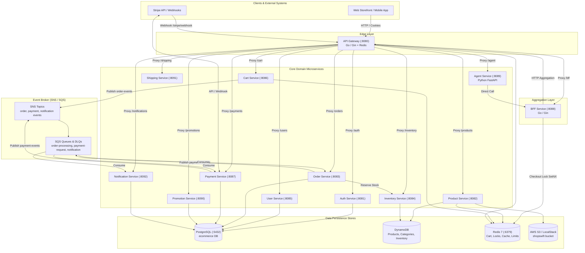
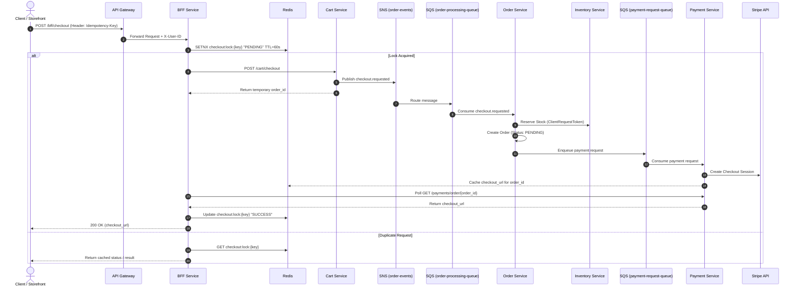
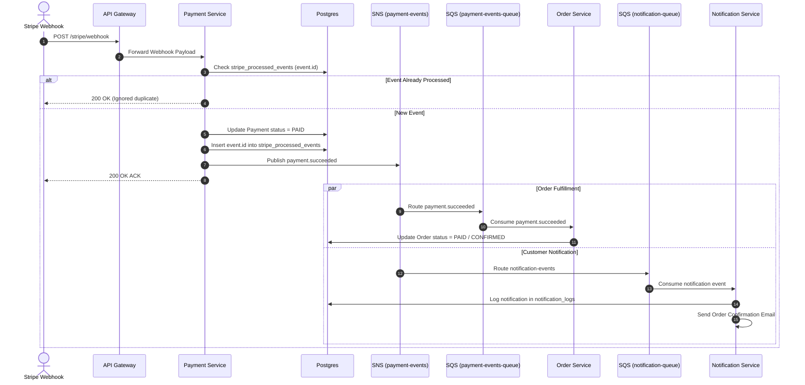

# ShopSwift — Microservice Architecture Documentation

Comprehensive architecture specification for the **ShopSwift** e-commerce backend platform.

---

## 1. Executive Overview

ShopSwift is an enterprise-grade e-commerce microservices platform built primarily with **Go 1.25** (multi-module workspace) and a **Python (FastAPI)** AI Agent service. The system is designed around an event-driven architecture using AWS services (S3, DynamoDB, SNS, SQS) fully emulated locally via **LocalStack**, alongside **PostgreSQL** for relational transactions and **Redis** for state caching, rate limiting, and distributed locking.

### Key Architectural Principles
- **API Gateway + BFF Pattern**: Gateway handles edge routing, rate limiting, correlation IDs, and JWT validation. The BFF (Backend-For-Frontend) handles domain aggregation and async checkout orchestration.
- **Polyglot Persistence**: 
  - **PostgreSQL**: Transactional entities (Users, Orders, Payments, Coupons, Notifications).
  - **DynamoDB**: High-throughput catalog, category adjacency graphs, and inventory stock.
  - **Redis**: Cart state, product catalog caching, gateway rate limits, and checkout locks.
  - **AWS S3**: Product media assets.
- **Asynchronous Event-Driven Processing**: Orders, payments, and notifications are processed asynchronously via SNS topics and SQS queues with built-in Dead Letter Queues (DLQs).
- **Strict Idempotency & Safety**: Multi-tier idempotency guarantees across API calls (Client SetNX lock), SQS message processing (`idempotency_key` columns), inventory updates (`ClientRequestToken`), and Stripe webhooks (`stripe_processed_events`).

---

## 2. System Architecture Diagram



---

## 3. Microservices Directory & Topology

| Service | Port | Technology | Primary Data Store | Responsibility Summary |
|:---|:---:|:---|:---|:---|
| **api-gateway** | `8080` | Go / Gin | Redis | Edge router, JWT validation, rate limiting, `X-Request-ID` correlation, client header sanitization. |
| **auth-service** | `8081` | Go / Gin | Postgres (`users`, `refresh_tokens`) | Identity authentication, token refresh, password hashing, admin bootstrapping. |
| **product-service** | `8082` | Go / Gin | DynamoDB + Redis + AWS S3 | Catalog items, categories, category-product adjacency graph, S3 image uploads, cache versioning. |
| **order-service** | `8083` | Go / Gin | Postgres (`orders`, `order_items`) + SQS | Order state machine, stock reservation integration, payment request dispatch. |
| **inventory-service** | `8084` | Go / Gin | DynamoDB (`Inventory`) | Real-time stock levels, idempotent reservations (`ClientRequestToken`), stock confirmations. |
| **user-service** | `8085` | Go / Gin | Postgres (`users`, `addresses`) | Customer profiles, address book management. |
| **cart-service** | `8086` | Go / Gin | Redis | Real-time user shopping cart storage, cart checkout event publishing. |
| **payment-service** | `8087` | Go / Gin | Postgres (`payments`, `stripe_processed_events`) | Stripe Checkout session creation, webhook processing, payment event publishing. |
| **bff-service** | `8088` | Go / Gin | Redis | Storefront aggregation (home, profile, checkout), checkout idempotency (`SetNX`), status polling. |
| **agent-service** | `8089` | Python / FastAPI | Stateless | AI-powered conversational backend assistant interacting with the BFF. |
| **promotion-service**| `8090` | Go / Gin | Postgres (`coupons`) | Coupon rules, atomic coupon usage limit checks and discounts. |
| **shipping-service** | `8091` | Go / Gin | In-Memory / Static JSON | Zone-based shipping rate calculations and delivery estimations. |
| **notification-service**| `8092` | Go / Gin | Postgres (`notification_logs`) + SQS | Async notification consumer (`notification-queue`), transactional emails. |

---

## 4. Data Architecture & Ownership Matrix

### 4.1 PostgreSQL (`ecommerce` database)
Single shared Postgres database instance with clear per-service table ownership boundary:

```
ecommerce/
 ├── users                   [Owned by auth-service (auth credentials) & user-service (profile)]
 ├── refresh_tokens          [Owned by auth-service]
 ├── addresses               [Owned by user-service]
 ├── orders                  [Owned by order-service]
 ├── order_items             [Owned by order-service]
 ├── payments                [Owned by payment-service]
 ├── stripe_processed_events [Owned by payment-service (webhook deduplication)]
 ├── coupons                 [Owned by promotion-service]
 └── notification_logs       [Owned by notification-service]
```

### 4.2 DynamoDB Tables

| Table Name | Environment Key | Partition Key (PK) | Sort Key (SK) / GSIs | Managing Service |
|:---|:---|:---|:---|:---|
| **Products** | `DDB_TABLE_PRODUCTS` | `id` (String) | GSIs: `sku-index` (`sku`), `featured-index` (`is_featured`, `created_at`) | `product-service` |
| **Categories** | `DDB_TABLE_CATEGORIES` | `id` (String) | GSI: `name-index` (`name`) | `product-service` |
| **ProductCategories** | `DDB_TABLE_PRODUCT_CATEGORIES` | `category_id` | `product_id` (GSI: `product-index` on `product_id`) | `product-service` |
| **Inventory** | `DDB_TABLE_INVENTORY` | `product_id` | — | `inventory-service` |

### 4.3 Redis Data Structure Usage

- **Cart (`cart-service`)**: Key `cart:{user_id}` storing JSON cart items.
- **Checkout Idempotency (`bff-service`)**: Key `checkout:lock:{idempotency_key}` using `SetNX` with TTL for atomic request locking and result caching.
- **Gateway Rate Limiting (`api-gateway`)**: Key `ratelimit:{ip/user_id}` managing window counters.
- **Product Caching (`product-service`)**: Product catalog queries cached with version-invalidation tags.

---

## 5. Event-Driven Messaging Architecture

### 5.1 SNS Topics & SQS Queue Map

```
[ Cart Service ] ---> ( SNS: order-events ) 
                             │
                             └───> [ SQS: order-processing-queue ] ---> [ Order Service ]
                                                                             │
                                                                             └───> [ SQS: payment-request-queue ] ---> [ Payment Service ]
                                                                                                                           │
[ Stripe Webhook ] ────────────────────────────────────────────────────────────────────────────────────────────────────────┘
                                                                                                                           │
[ Payment Service ] ---> ( SNS: payment-events ) 
                              │
                              ├───> [ SQS: payment-events-queue ] ---> [ Order Service (Confirm Order) ]
                              └───> [ SQS: notification-queue ]  ---> [ Notification Service (Send Email) ]
```

---

## 6. Critical Workflows & Sequence Diagrams

### 6.1 Asynchronous Checkout Flow



### 6.2 Payment Confirmation & Fulfillment Flow



---

## 7. Security, Authorization & Idempotency

### 7.1 Security & Auth Model
- **Authentication**: `auth-service` issues JWT access tokens and HTTP-only refresh tokens.
- **Gateway Injection**: `api-gateway` strips any client-provided identity headers (`X-User-ID`, `X-User-Role`), validates the JWT, and injects validated identity context headers into internal requests.
- **Role-Based Access Control (RBAC)**: Routes marked with admin privileges require `X-User-Role: admin`. Domain services re-verify roles for sensitive operations (e.g., product creation, admin user creation).

### 7.2 Idempotency Architecture
1. **API Level**: Client sends `Idempotency-Key` header to `/bff/checkout`. BFF uses Redis `SetNX` to lock concurrent requests.
2. **Order Creation**: Order Service verifies unique `idempotency_key` constraint on PostgreSQL `orders` table.
3. **Inventory Management**: Inventory Service utilizes DynamoDB conditional updates with `ClientRequestToken` for idempotent stock reservation and release.
4. **Stripe Webhooks**: Payment Service tracks processed Stripe event IDs in `stripe_processed_events` table before executing downstream event dispatch.

---

## 8. Local Development & Operational Tools

### 8.1 Prerequisites
- Docker & Docker Compose
- Go 1.25+
- LocalStack (emulating AWS S3, DynamoDB, SNS, SQS)

### 8.2 Environment Startup
```bash
cd backend
cp .env.example .env
./scripts/dev-up.sh
```

### 8.3 Database Migrations & Data Seeding
```bash
# Run SQL Migrations
cd backend
./scripts/migrate.sh up

# Seed Demo Data (Products, Categories, Inventory)
./scripts/seed_demo_data.sh
```

---

## 9. Author & Maintainer

- **Yash Rajoria** — [GitHub](https://github.com/yashrajoria) · [LinkedIn](https://www.linkedin.com/in/yashrajoria)
