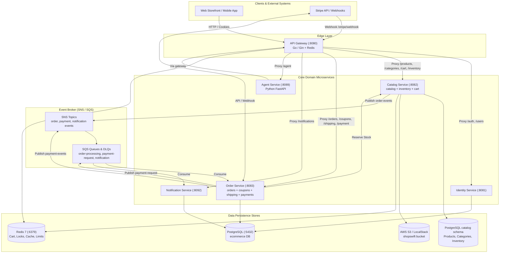
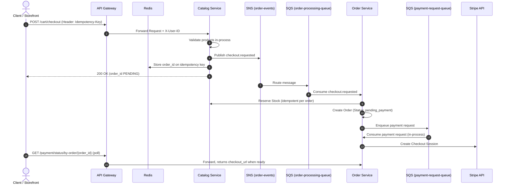
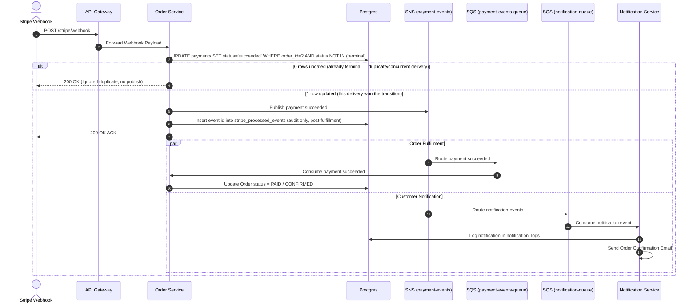

# ShopSwift — Microservice Architecture Documentation

Comprehensive architecture specification for the **ShopSwift** e-commerce backend platform.

---

## 1. Executive Overview

ShopSwift is an enterprise-grade e-commerce microservices platform built primarily with **Go 1.25** (multi-module workspace) and a **Python (FastAPI)** AI Agent service. The system is designed around an event-driven architecture using AWS services (S3, SNS, SQS) fully emulated locally via **LocalStack**, alongside **PostgreSQL** for relational transactions and **Redis** for state caching, rate limiting, and distributed locking.

### Key Architectural Principles
- **API Gateway edge**: Gateway handles edge routing, rate limiting, correlation IDs, and JWT validation. Storefront clients call domain routes directly; `/bff/admin/*` is retained as the admin/analytics path contract.
- **Polyglot Persistence**:
  - **PostgreSQL**: Transactional entities (Users, Orders, Payments, Coupons, Notifications).
  - **PostgreSQL `catalog` schema**: catalog, category links, and inventory stock with transactional reservations.
  - **Redis**: Cart state + checkout idempotency replay, product catalog caching, bulk-import queue, gateway rate limits.
  - **AWS S3**: Product media assets.
- **Asynchronous Event-Driven Processing**: Orders, payments, and notifications are processed asynchronously via SNS topics and SQS queues with built-in Dead Letter Queues (DLQs).
- **Strict Idempotency & Safety**: Multi-tier idempotency guarantees across API calls (user-scoped idempotency keys with cached replay), SQS message processing (`idempotency_key` columns), inventory reservations (`(order_id, product_id)` rows with replay-safe status transitions), and Stripe webhooks (`stripe_processed_events`).

---

## 2. System Architecture Diagram


```mermaid
flowchart TB
  subgraph Clients ["Clients & External Systems"]
    Web["Web Storefront / Mobile App"]
    StripeExt["Stripe API / Webhooks"]
  end

  subgraph EdgeLayer ["Edge Layer"]
    GW["API Gateway (:8080)<br/>Go / Gin + Redis"]
  end

  subgraph CoreServices ["Core Domain Microservices"]
    IDENT["Identity Service (:8081)"]
    CATALOG["Catalog Service (:8082)<br/>catalog + inventory + cart"]
    ORDER["Order Service (:8083)<br/>orders + coupons + shipping + payments"]
    NOTIF["Notification Service (:8092)"]
    AGENT["Agent Service (:8089)<br/>Python FastAPI"]
  end

  subgraph Storage ["Data Persistence Stores"]
    PG[("PostgreSQL (:5432)<br/>ecommerce DB")]
    DDB[("PostgreSQL catalog schema<br/>Products, Categories, Inventory")]
    REDIS[("Redis 7 (:6379)<br/>Cart, Locks, Cache, Limits")]
    S3[("AWS S3 / LocalStack<br/>shopswift bucket")]
  end

  subgraph Messaging ["Event Broker (SNS / SQS)"]
    SNS["SNS Topics<br/>order, payment, notification events"]
    SQS["SQS Queues & DLQs<br/>order-processing, payment-request, notification"]
  end

  %% HTTP Flows
  Web -->|HTTP / Cookies| GW
  GW -->|Proxy /auth, /users| IDENT
  GW -->|Proxy /products, /categories, /cart, /inventory| CATALOG
  GW -->|Proxy /orders, /coupons, /shipping, /payment| ORDER
  GW -->|Proxy /notifications| NOTIF
  GW -->|Proxy /agent| AGENT

  AGENT -->|Via gateway| GW
  StripeExt -->|Webhook /stripe/webhook| GW

  %% Data Store Connections
  IDENT --> PG
  ORDER --> PG
  NOTIF --> PG

  CATALOG --> DDB
  CATALOG --> S3
  CATALOG --> REDIS
  GW --> REDIS

  %% Async Event Connections
  CATALOG -->|Publish order-events| SNS
  ORDER -->|Publish payment-request| SQS
  ORDER -->|Publish payment-events| SNS
  StripeExt <-->|API / Webhook| ORDER
  SNS --> SQS
  SQS -->|Consume| ORDER
  SQS -->|Consume| NOTIF
  ORDER -->|Reserve Stock| CATALOG
```

---

## 3. Microservices Directory & Topology

| Service | Port | Technology | Primary Data Store | Responsibility Summary |
|:---|:---:|:---|:---|:---|
| **api-gateway** | `8080` | Go / Gin | Redis | Edge router, JWT validation, rate limiting, `X-Request-ID` correlation, client header sanitization. |
| **identity-service** | `8081` | Go / Gin | Postgres (`users`, `refresh_tokens`, `addresses`) | Identity authentication, token refresh, password hashing, admin bootstrapping, profiles, addresses. |
| **catalog-service** | `8082` | Go / Gin | Postgres (`catalog` schema) + Redis + AWS S3 | Catalog items, categories, adjacency graph, S3 image uploads, cache versioning, stock levels + idempotent reservations, Redis cart + SNS checkout. |
| **order-service** | `8083` | Go / Gin | Postgres (`orders`, `order_items`, `coupons`, `payments`, `stripe_processed_events`) + SQS + Stripe | Order state machine, stock reservation integration, coupons, zone shipping rates, Stripe Checkout + webhooks. |
| **agent-service** | `8089` | Python / FastAPI | Stateless | AI-powered conversational backend assistant calling domain + admin analytics paths via the gateway. |
| **notification-service**| `8092` | Go / Gin | Postgres (`notification_logs`) + SQS | Async notification consumer (`notification-queue`), transactional emails. |

---

## 4. Data Architecture & Ownership Matrix

### 4.1 PostgreSQL (`ecommerce` database)
Single shared Postgres database instance with clear per-service table ownership boundary:

```
ecommerce/
 ├── users                   [Owned by identity-service]
 ├── refresh_tokens          [Owned by identity-service]
 ├── addresses               [Owned by identity-service]
 ├── orders                  [Owned by order-service]
 ├── order_items             [Owned by order-service]
 ├── payments                [Owned by order-service]
 ├── stripe_processed_events [Owned by order-service (webhook deduplication)]
 ├── coupons                 [Owned by order-service]
 └── notification_logs       [Owned by notification-service]
```

### 4.2 PostgreSQL `catalog` Schema

| Table | Primary Key | Notes | Managing Service |
|:---|:---|:---|:---|
| **products** | `id` | live-unique `sku`; partial indexes on `created_at`, `brand`, `is_featured`; soft delete | `catalog-service` |
| **categories** | `id` | jsonb `parent_ids` / `ancestors` / `path`; tree assembled in memory | `catalog-service` |
| **product_categories** | `(category_id, product_id)` | many-to-many link, indexed by `product_id` | `catalog-service` |
| **inventory** | `product_id` | `available` / `reserved` / `threshold`, CHECK >= 0 | `catalog-service` |
| **stock_reservations** | `(order_id, product_id)` | `status` reserved / confirmed / released; purged after 30 days | `catalog-service` |

### 4.3 Redis Data Structure Usage

- **Cart (`catalog-service`)**: Key `cart:user:{user_id}` storing JSON cart items.
- **Checkout Idempotency (`catalog-service`)**: Key `idem:cart:{user_id}:{hash}` caching `order_id` for retried checkouts.
- **Gateway Rate Limiting (`api-gateway`)**: Key `ratelimit:{ip/user_id}` managing window counters.
- **Product Caching (`catalog-service`)**: Product catalog queries cached with version-invalidation tags.
- **Bulk Import (`catalog-service`)**: `bulk_import:queue` list + `bulk_import:job:{id}` hashes.

---

## 5. Event-Driven Messaging Architecture

### 5.1 SNS Topics & SQS Queue Map

```
[ Cart Service ] ---> ( SNS: order-events ) 
                             │
                             └───> [ SQS: order-processing-queue ] ---> [ Order Service ]
                                                                             │
                                                                             └───> [ SQS: payment-request-queue ] ---> [ Payment Service ]
                                                                                                                           │
[ Stripe Webhook ] ────────────────────────────────────────────────────────────────────────────────────────────────────────┘
                                                                                                                           │
[ Payment Service ] ---> ( SNS: payment-events ) 
                              │
                              ├───> [ SQS: payment-events-queue ] ---> [ Order Service (Confirm Order) ]
                              └───> [ SQS: notification-queue ]  ---> [ Notification Service (Send Email) ]
```

---

## 6. Critical Workflows & Sequence Diagrams

### 6.1 Asynchronous Checkout Flow


```mermaid
sequenceDiagram
  autonumber
  actor Client as Client / Storefront
  participant GW as API Gateway
  participant Redis as Redis
  participant Catalog as Catalog Service
  participant SNS as SNS (order-events)
  participant SQS_Order as SQS (order-processing-queue)
  participant Order as Order Service
  participant SQS_Pay as SQS (payment-request-queue)
  participant Stripe as Stripe API

  Client->>GW: POST /cart/checkout (Header: Idempotency-Key)
  GW->>Catalog: Forward Request + X-User-ID
  Catalog->>Catalog: Validate products in-process
  Catalog->>SNS: Publish checkout.requested
  Catalog->>Redis: Store order_id on idempotency key
  Catalog-->>Client: 200 OK (order_id PENDING)
  SNS->>SQS_Order: Route message
  SQS_Order->>Order: Consume checkout.requested
  Order->>Catalog: Reserve Stock (idempotent per order)
  Order->>Order: Create Order (Status: pending_payment)
  Order->>SQS_Pay: Enqueue payment request
  SQS_Pay->>Order: Consume payment request (in-process)
  Order->>Stripe: Create Checkout Session
  Client->>GW: GET /payment/status/by-order/{order_id} (poll)
  GW->>Order: Forward, returns checkout_url when ready
```

### 6.2 Payment Confirmation & Fulfillment Flow


```mermaid
sequenceDiagram
  autonumber
  actor Stripe as Stripe Webhook
  participant GW as API Gateway
  participant Order as Order Service
  participant PG as Postgres
  participant SNS as SNS (payment-events)
  participant SQS_Order as SQS (payment-events-queue)
  participant SQS_Notif as SQS (notification-queue)
  participant Notif as Notification Service

  Stripe->>GW: POST /stripe/webhook
  GW->>Order: Forward Webhook Payload
  Order->>PG: UPDATE payments SET status='succeeded' WHERE order_id=? AND status NOT IN (terminal)
  alt 0 rows updated (already terminal — duplicate/concurrent delivery)
    Order-->>Stripe: 200 OK (Ignored duplicate, no publish)
  else 1 row updated (this delivery won the transition)
    Order->>SNS: Publish payment.succeeded
    Order->>PG: Insert event.id into stripe_processed_events (audit only, post-fulfillment)
    Order-->>Stripe: 200 OK ACK
    
    par Order Fulfillment
      SNS->>SQS_Order: Route payment.succeeded
      SQS_Order->>Order: Consume payment.succeeded
      Order->>PG: Update Order status = PAID / CONFIRMED
    and Customer Notification
      SNS->>SQS_Notif: Route notification-events
      SQS_Notif->>Notif: Consume notification event
      Notif->>PG: Log notification in notification_logs
      Notif->>Notif: Send Order Confirmation Email
    end
  end
```

The dedup guard is the conditional `UPDATE` (`status NOT IN (terminal)`), not the `stripe_processed_events` lookup — that table is written only after fulfillment for audit/traceability and is never queried before processing. Two concurrent deliveries of the same event race on the same conditional `UPDATE`; only the winner publishes. See `services/order-service/payment/repository/payment_repository.go` (`UpdateIfStatusNotIn`) and the regression test `services/order-service/payment/controllers/payment_webhook_redelivery_test.go`.

---

## 7. Security, Authorization & Idempotency

### 7.1 Security & Auth Model
- **Authentication**: `identity-service` issues JWT access tokens and HTTP-only refresh tokens.
- **Gateway Injection**: `api-gateway` strips any client-provided identity headers (`X-User-ID`, `X-User-Role`), validates the JWT, and injects validated identity context headers into internal requests.
- **Role-Based Access Control (RBAC)**: Routes marked with admin privileges require `X-User-Role: admin`. Domain services re-verify roles for sensitive operations (e.g., product creation, admin user creation).

### 7.2 Idempotency Architecture
1. **API Level**: Client sends `Idempotency-Key` header to `POST /cart/checkout`. Catalog hashes it user-scoped (`idem:cart:*`) and replays the cached `order_id` on retry.
2. **Order Creation**: Order Service verifies unique `idempotency_key` constraint on PostgreSQL `orders` table.
3. **Inventory Management**: Catalog reserves, confirms and releases stock in single Postgres transactions over `inventory` + `stock_reservations`; replays are no-ops and products are locked in id order.
4. **Stripe Webhooks**: Order Service guards the terminal status transition with an atomic conditional `UPDATE ... WHERE status NOT IN (terminal)`, so a redelivered event that loses the race is a no-op and never re-publishes. `stripe_processed_events` records the event ID for audit/traceability after fulfillment; it is not the dedup mechanism.

---

## 8. Local Development & Operational Tools

### 8.1 Prerequisites
- Docker & Docker Compose
- Go 1.25+
- LocalStack (emulating AWS S3, SNS, SQS)

### 8.2 Environment Startup
```bash
cd backend
cp .env.example .env
./scripts/dev-up.sh
```

### 8.3 Database Migrations & Data Seeding
```bash
# Run SQL Migrations
cd backend
./scripts/migrate.sh up

# Seed Demo Data (Products, Categories, Inventory)
DATABASE_URL=... ./scripts/seed_catalog.sh   # see script header for a no-psql variant
```

---

## 9. Author & Maintainer

- **Yash Rajoria** — [GitHub](https://github.com/yashrajoria) · [LinkedIn](https://www.linkedin.com/in/yashrajoria)
