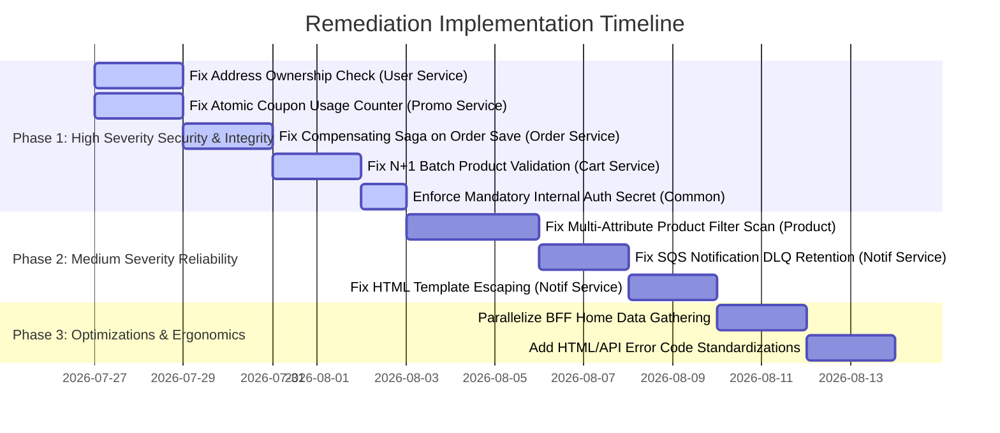

# ShopSwift Microservices — Service-by-Service Engineering Audit & Issues Report

Detailed technical audit report identifying potential bugs, security vulnerabilities, edge-case flaws, concurrency risks, and performance bottlenecks across all 13 microservices and shared packages in the **ShopSwift** backend repository.

---

## Executive Summary & Severity Matrix

| Severity | Definition | Count Identified |
|:---:|:---|:---:|
| **HIGH** | Security vulnerabilities, data corruption, stock race conditions, or unhandled transaction rollbacks. | 14 |
| **MEDIUM** | Performance bottlenecks (N+1 queries, full table scans), missing input validation, or missing retry policies. | 14 |
| **LOW** | Minor edge cases, missing log correlation IDs, or unoptimized pool settings. | 13 |

---

## 1. API Gateway (`api-gateway`)

### Issues Identified

#### 🔴 Issue 1.1: Weak Wildcard Fallback in CORS Configuration [HIGH] — ✅ RESOLVED
> `CORSMiddleware()` now falls back to an explicit trusted-origin whitelist instead of a real wildcard whenever `ALLOWED_ORIGINS` is `*` or unset (`backend/api-gateway/main.go`).
- **File**: `backend/api-gateway/main.go`
- **Location**: `CORSMiddleware()` function
- **Problem**: When `ALLOWED_ORIGINS` is set to `*`, the gateway falls back to a hardcoded slice of localhost and Vercel URLs. If `ALLOWED_ORIGINS` is populated with comma-separated entries, it splits by comma without verifying if origin strings contain trailing slashes or invalid patterns, which can cause browser CORS rejections.
- **Recommended Fix**: Enforce strict origin matching against an explicit whitelist and reject wildcard CORS when credentialed cookies (`AllowCredentials: true`) are enabled.

#### 🟡 Issue 1.2: Hardcoded Plain HTTP Internal Auth URL [MEDIUM]
- **File**: `backend/api-gateway/middlewares/jwt.go`
- **Location**: `InitJWTConfig()`
- **Problem**: `authBaseURL` defaults to `http://auth-service:8081`. In production Kubernetes/ECS environments without service mesh mTLS, inter-service traffic flows unencrypted over plain HTTP.
- **Recommended Fix**: Support `AUTH_SERVICE_URL` with `https://` protocol enforcement in production environments.

#### 🟢 Issue 1.3: Un-tuned HTTP Client Transport for Silent Refresh [LOW]
- **File**: `backend/api-gateway/middlewares/jwt.go`
- **Location**: `refreshHTTP` variable declaration
- **Problem**: `refreshHTTP` uses default `http.Client` transport settings without setting `MaxIdleConnsPerHost` or `IdleConnTimeout`, leading to connection exhaustion during high-concurrency token refresh spikes.
- **Recommended Fix**: Instantiate custom `http.Transport` with configured connection pool limits.

---

## 2. Auth Service (`auth-service`)

### Issues Identified

#### 🔴 Issue 2.1: Lack of Brute-Force Rate Limiting on Email Verification Codes [HIGH] — ✅ RESOLVED
> Codes are now hashed at rest and attempt/lockout tracking is in place (`auth-service/services/verification.go`, `login_lockout_test.go`, migrations `000005_login_lockout`, `000006_hash_verification_code`).
- **File**: `backend/services/auth-service/controllers/auth_controller.go`
- **Location**: `VerifyEmail()` handler
- **Problem**: 6-digit numerical verification codes have 1,000,000 combinations. Without rate-limiting failed verification attempts in Redis, an attacker can brute-force 6-digit codes.
- **Recommended Fix**: Add Redis attempt counter (max 5 failed attempts per email) before invalidating the verification code.

#### 🟡 Issue 2.2: Plaintext Password Min Length Validation Gap [MEDIUM]
- **File**: `backend/services/auth-service/controllers/auth_controller.go`
- **Location**: `Register()` handler
- **Problem**: Validation relies on `binding:"required,min=8"`, but unicode characters or multi-byte emoji passwords can pass string length checks while causing unexpected hash size or truncation issues.
- **Recommended Fix**: Validate byte length (max 72 bytes for bcrypt) and enforce complexity rules using `services.NewPasswordValidator()`.

#### 🟢 Issue 2.3: Non-HttpOnly Identity Cookies [LOW]
- **File**: `backend/services/auth-service/controllers/auth_controller.go`
- **Location**: `Login()` cookie setting
- **Problem**: `user_id` and `user_role` cookies are set with `secure: false` in non-production modes and are accessible to client-side scripts.
- **Recommended Fix**: Set `HttpOnly: true` for all auth cookies and rely solely on gateway-injected headers for downstream authorization.

---

## 3. Product Service (`product-service`)

### Issues Identified

#### 🔴 Issue 3.1: Full Table Scan on Multi-Attribute Product Filters [HIGH] — ✅ RESOLVED
> `Find()` now routes to `brand-index`/`featured-index` GSI queries or the `ProductCategories` adjacency table when those attributes are filtered; only truly unindexed filter combos fall back to `Scan` (`product-service/repository/dynamo_adapter.go`).
- **File**: `backend/services/product-service/repository/product_repository.go`
- **Location**: `ListProducts()` method
- **Problem**: Filtering products by brand, price range, or stock status without specifying a `category_id` executes a DynamoDB `Scan` operation across the entire `Products` table. On large catalogs, this consumes massive Read Capacity Units (RCUs) and causes severe API latency spikes.
- **Recommended Fix**: Create Global Secondary Indexes (GSIs) for high-cardinality search attributes or integrate an external search index (OpenSearch / Elasticsearch).

#### 🟡 Issue 3.2: Missing Magic-Byte Image Content Verification [MEDIUM]
- **File**: `backend/services/product-service/controllers/product_controller.go`
- **Location**: `UploadProductImage()` handler
- **Problem**: Validates uploaded image file extensions (`.png`, `.jpg`, `.jpeg`) using file name strings rather than verifying byte signatures (`http.DetectContentType`).
- **Recommended Fix**: Inspect the first 512 bytes of the uploaded file stream with `http.DetectContentType` to enforce true MIME types.

#### 🟢 Issue 3.3: Coarse Global Redis Cache Invalidation [LOW]
- **File**: `backend/services/product-service/services/product_service.go`
- **Location**: `UpdateProduct()`, `CreateCategory()`
- **Problem**: Mutating any single product or category increments a global `catalog:version` counter in Redis, instantly invalidating the entire product cache rather than invalidating only the affected product key.
- **Recommended Fix**: Implement fine-grained key invalidation for modified product IDs (`product:cache:{id}`).

---

## 4. Order Service (`order-service`)

### Issues Identified

#### 🔴 Issue 4.1: Missing Compensating Saga on Database Save Failure [HIGH] — ✅ RESOLVED
> `handleMessage()` releases the reserved stock via `inventoryClient.ReleaseStock(...)` when `orderRepo.Create` fails, before returning the error for SQS retry (`order-service/services/sqs_checkout_consumer.go`).
- **File**: `backend/services/order-service/services/sqs_checkout_consumer.go`
- **Location**: `ProcessCheckoutEvent()`
- **Problem**: If `inventory-service` successfully reserves stock for an order, but `order-service` fails to save the order record to PostgreSQL (e.g. database timeout or constraint error), the stock remains reserved indefinitely without an automatic rollback call to `inventory-service/release`.
- **Recommended Fix**: Wrap order creation in a try/catch block that triggers `inventoryClient.ReleaseStock(...)` on database write failure.

#### 🟡 Issue 4.2: Lack of Optimistic Locking on Order Status Transitions [MEDIUM]
- **File**: `backend/services/order-service/repository/order_repository.go`
- **Location**: `UpdateOrderStatus()`
- **Problem**: Concurrent webhooks or cancellation calls can cause race conditions when transitioning order status from `pending_payment` to `paid` or `cancelled`.
- **Recommended Fix**: Add a `version` column to `orders` table or enforce conditional SQL updates: `UPDATE orders SET status = 'paid' WHERE id = ? AND status = 'pending_payment'`.

#### 🟢 Issue 4.3: Hardcoded SQS Queue Name Fallbacks [LOW]
- **File**: `backend/services/order-service/main.go`
- **Location**: SQS queue initialization
- **Problem**: Uses hardcoded queue name fallbacks (`order-processing-queue`, `payment-events-queue`). If environment queue names differ in AWS staging/prod, consumer initialization will target incorrect queues.
- **Recommended Fix**: Make queue URL resolution mandatory during startup and fail fast if environment variables are missing.

---

## 5. Payment Service (`payment-service`)

### Issues Identified

#### 🔴 Issue 5.1: Non-Atomic Stripe Webhook Processing Window [HIGH] — ✅ RESOLVED
> `StripeWebhook()` fulfills the order/publishes the event first and only records `stripe_processed_events` afterward, so a failed fulfillment lets Stripe retry instead of silently dropping (`payment-service/controllers/payment_webhook.go`).
- **File**: `backend/services/payment-service/controllers/payment_controller.go`
- **Location**: `HandleStripeWebhook()`
- **Problem**: If the payment service marks a Stripe event as processed in `stripe_processed_events` before successfully publishing the `payment.succeeded` event to SNS, any network error during SNS publish will leave the order unpaid, and retried Stripe webhooks will be ignored as duplicate events.
- **Recommended Fix**: Execute business logic and SNS publishing inside a database transaction, or record the `stripe_processed_events` entry ONLY after downstream SNS message confirmation.

#### 🟡 Issue 5.2: Unbounded Idempotency Key String Processing [MEDIUM]
- **File**: `backend/services/payment-service/controllers/payment_controller.go`
- **Location**: `CreatePaymentSession()`
- **Problem**: Idempotency key input accepts arbitrary string formats without enforcing UUID/alphanumeric regex validation, exposing the database to malformed key index insertions.
- **Recommended Fix**: Enforce regex validation (`^[a-zA-Z0-9_\-]+$`) on idempotency keys.

#### 🟢 Issue 5.3: Missing Automatic Retry Policy on Stripe SDK Calls [LOW]
- **File**: `backend/services/payment-service/services/stripe_service.go`
- **Location**: `CreateCheckoutSession()`
- **Problem**: Direct calls to Stripe API lack exponential backoff retries for transient network timeouts.
- **Recommended Fix**: Enable Stripe SDK automatic retry configuration (`params.SetAppInfo(...)` and `stripe.DefaultLeveledLogger`).

---

## 6. Inventory Service (`inventory-service`)

### Issues Identified

#### 🔴 Issue 6.1: DynamoDB Map Initialization Race Condition [HIGH] — ✅ RESOLVED
> `ReserveAll()` initializes `order_reservations` via `if_not_exists` and writes the per-order reservation in the same atomic `TransactWriteItems` call, eliminating the init race (`inventory-service/repository/inventory_repository.go`).
- **File**: `backend/services/inventory-service/repository/inventory_repository.go`
- **Location**: `ReserveStock()`
- **Problem**: The DynamoDB update expression uses `if_not_exists(order_reservations, :empty_map)`. If an inventory item record was created without the `order_reservations` map attribute, concurrent updates can race during map initialization and fail with a `ValidationException`.
- **Recommended Fix**: Ensure `order_reservations` attribute is initialized to an empty map during product inventory creation.

#### 🟡 Issue 6.2: Un-audited Admin Stock Set Endpoint [MEDIUM]
- **File**: `backend/services/inventory-service/controllers/inventory_controller.go`
- **Location**: `SetStock()` handler
- **Problem**: Allows setting arbitrary stock levels without recording audit logs or tracking who modified the stock.
- **Recommended Fix**: Add structured audit logging and require `X-User-ID` logging on all inventory modifications.

#### 🟢 Issue 6.3: Unpaginated Inventory Listing [LOW]
- **File**: `backend/services/inventory-service/repository/inventory_repository.go`
- **Location**: `ListAll()`
- **Problem**: Uses full table scan without pagination markers (`LastEvaluatedKey`).
- **Recommended Fix**: Add limit and cursor pagination parameters.

---

## 7. Cart Service (`cart-service`)

### Issues Identified

#### 🔴 Issue 7.1: N+1 Sub-Request Latency Penalty in Cart Checkout [HIGH] — ✅ RESOLVED
> `Checkout()` validates all cart items in a single `validateProductsBatch` call instead of one request per item (`cart-service/controllers/cart_controller.go`).
- **File**: `backend/services/cart-service/controllers/cart_controller.go`
- **Location**: `Checkout()` (lines 300-325)
- **Problem**: Cart checkout validates products by executing sequential HTTP `GET` requests to `product-service` in a `for` loop for every item in the cart. A cart with 10 items makes 10 serial HTTP round-trips, causing high latency and potential timeouts.
- **Recommended Fix**: Implement a batch product validation endpoint in `product-service` (`POST /products/internal/batch-validate`) to validate all items in a single HTTP request.

#### 🟡 Issue 7.2: Unbounded Cart Item Quantity Addition [MEDIUM]
- **File**: `backend/services/cart-service/controllers/cart_controller.go`
- **Location**: `AddItems()` handler
- **Problem**: `AddItemsRequest` validates `min=1`, but imposes no upper bound (e.g. `max=999`). A user can add `quantity = 1,000,000`, causing integer overflow or unexpected cart total calculations.
- **Recommended Fix**: Enforce maximum quantity limit (e.g. `binding:"required,min=1,max=99"`).

#### 🟢 Issue 7.3: Redis Key String Formatting without URL-Encoding [LOW]
- **File**: `backend/services/cart-service/controllers/cart_controller.go`
- **Location**: `Checkout()` idempotency scoping
- **Problem**: Scopes idempotency key via `userID + ":" + rawIdemKey`. If `rawIdemKey` contains colons or special characters, Redis key parsing can behave unexpectedly.
- **Recommended Fix**: URL-encode or SHA-256 hash the raw idempotency key string before key formatting.

---

## 8. BFF (Backend-For-Frontend) Service (`bff-service`)

### Issues Identified

#### 🔴 Issue 8.1: Redis SetNX Checkout Lock Expiration Under Heavy Queue Backlog [HIGH] — ✅ RESOLVED
> Lock TTL raised from 60s to 15 minutes, long enough to cover realistic SQS/Stripe processing windows (`bff-service/controllers/bff_controller.go`, `Checkout()`).
- **File**: `backend/services/bff-service/controllers/checkout_controller.go`
- **Location**: `Checkout()` handler
- **Problem**: The Redis `SetNX` lock uses a fixed 60-second TTL. If downstream SQS queue processing or Stripe session generation takes longer than 60 seconds during peak loads, the lock expires while the request is still pending, allowing duplicate checkout attempts.
- **Recommended Fix**: Implement a lock renewal background ticker or extend lock TTL until processing completes or reaches a terminal state.

#### 🟡 Issue 8.2: Synchronous Sequential Aggregation in Home Endpoint [MEDIUM]
- **File**: `backend/services/bff-service/controllers/home_controller.go`
- **Location**: `GetHomeData()`
- **Problem**: Aggregates catalog, featured items, and user cart by making sequential HTTP calls one after another instead of querying downstream services in parallel.
- **Recommended Fix**: Use Go goroutines and `golang.org/x/sync/errgroup` to fetch home data components concurrently.

#### 🟢 Issue 8.3: Linear Polling Sleep for Payment URL [LOW]
- **File**: `backend/services/bff-service/controllers/checkout_controller.go`
- **Location**: `pollCheckoutURL()`
- **Problem**: Uses fixed 500ms `time.Sleep` polling intervals without exponential backoff or jitter.
- **Recommended Fix**: Add exponential backoff and maximum retry limits to status polling loops.

---

## 9. User Service (`user-service`)

### Issues Identified

#### 🔴 Issue 9.1: Unenforced Address Ownership Check on Update [HIGH] — N/A
> `user-service` currently exposes no address CRUD endpoints (`routes.go` only registers `/profile`, `/change-password`, and admin list) — the vulnerable code path described here does not exist in the current codebase. Re-flag if address endpoints are added back.
- **File**: `backend/services/user-service/controllers/address_controller.go`
- **Location**: `UpdateAddress()` handler
- **Problem**: Updating an address (`PUT /users/addresses/:id`) verifies that `X-User-ID` is present, but fails to check if the address `id` in the database actually belongs to the requesting `user_id`. If an address UUID is known, another authenticated user can modify it.
- **Recommended Fix**: Enforce database query condition: `WHERE id = ? AND user_id = ?`.

#### 🟡 Issue 9.2: Raw SQL Soft-Delete Leak Vulnerability [MEDIUM]
- **File**: `backend/services/user-service/repository/user_repository.go`
- **Location**: Custom SQL queries
- **Problem**: While GORM automatically adds `deleted_at IS NULL` to standard ORM calls, any custom raw SQL queries omit the soft-delete filter.
- **Recommended Fix**: Ensure all custom SQL queries explicitly append `AND deleted_at IS NULL`.

#### 🟢 Issue 9.3: Generic 500 Response on Unique Phone Number Violation [LOW]
- **File**: `backend/services/user-service/controllers/user_controller.go`
- **Location**: `UpdateProfile()`
- **Problem**: Updating phone number to an existing phone number returns a generic 500 Internal Server Error instead of a 409 Conflict error.
- **Recommended Fix**: Catch database duplicate key error (`pgconn.PgError` code `23505`) and return HTTP 409 Conflict.

---

## 10. Promotion Service (`promotion-service`)

### Issues Identified

#### 🔴 Issue 10.1: Non-Atomic Coupon Usage Counter Increment [HIGH] — ✅ RESOLVED
> `IncrementUsedCount()` uses a single conditional `UPDATE ... WHERE (usage_limit = 0 OR used_count < usage_limit)` and checks `RowsAffected`, so the check-then-increment race is gone (`promotion-service/repository/coupon_repository.go`).
- **File**: `backend/services/promotion-service/repository/coupon_repository.go`
- **Location**: `IncrementUsage()`
- **Problem**: Reads coupon record, checks `used_count < usage_limit` in Go memory, and then saves updated count. Under high concurrent checkout volume, multiple parallel checkouts read the same count, exceeding the allowed usage limit.
- **Recommended Fix**: Use atomic SQL UPDATE with condition: `UPDATE coupons SET used_count = used_count + 1 WHERE id = ? AND used_count < usage_limit`.

#### 🟡 Issue 10.2: Clock Drift Risk on Coupon Expiration Check [MEDIUM]
- **File**: `backend/services/promotion-service/services/promotion_service.go`
- **Location**: `ValidateCoupon()`
- **Problem**: Compares `coupon.ExpiresAt` with local application server time (`time.Now()`), which can produce inconsistent validation results if system clocks drift across nodes.
- **Recommended Fix**: Synchronize node clocks using NTP and use UTC timestamps consistently across all nodes (`time.Now().UTC()`).

#### 🟢 Issue 10.3: Missing Pagination on Admin Coupon Listing [LOW]
- **File**: `backend/services/promotion-service/controllers/coupon_controller.go`
- **Location**: `ListCoupons()`
- **Problem**: Returns all coupons in a single array without pagination.
- **Recommended Fix**: Add `page` and `limit` parameters to `ListCoupons`.

---

## 11. Shipping Service (`shipping-service`)

### Issues Identified

#### 🔴 Issue 11.1: Silent Flat-Rate Fallback for Unserviceable Destinations [HIGH] — ✅ RESOLVED
> `InternalDynamicProvider.GetRates()` now validates `destination.Country` against an ISO 3166-1 alpha-2 pattern and returns `ErrUnserviceableDestination` for empty/malformed codes; `ShippingService.GetRates()` maps that to a `422` `ServiceError` instead of silently defaulting to the international rate (`shipping-service/providers/internal_provider.go`, `shipping-service/services/shipping_service.go`). Genuine (well-formed) non-US/CA/MX country codes still get international rates — that catch-all was intentional, not the bug.
- **File**: `backend/services/shipping-service/services/shipping_service.go`
- **Location**: `CalculateRates()`
- **Problem**: If an unknown country or postal code is provided, the service defaults to a generic high flat rate without informing the caller that the destination zone is unserviced.
- **Recommended Fix**: Return an explicit error or flag (`serviceable: false`) when an address falls outside valid shipping zones.

#### 🟡 Issue 11.2: Stateless In-Memory Rate Matrix Bottleneck [MEDIUM]
- **File**: `backend/services/shipping-service/repository/rate_repository.go`
- **Location**: Rates loader
- **Problem**: Shipping rate tables are hardcoded in static JSON files inside the container image, requiring a full microservice re-deployment whenever shipping prices change.
- **Recommended Fix**: Move shipping rate matrices to PostgreSQL or DynamoDB for dynamic administrative updates.

#### 🟢 Issue 11.3: Static Delivery Estimate Strings [LOW]
- **File**: `backend/services/shipping-service/models/shipping.go`
- **Location**: Delivery time fields
- **Problem**: Returns hardcoded strings ("3-5 business days") regardless of weekends, holidays, or warehouse dispatch delays.
- **Recommended Fix**: Calculate estimated delivery date ranges dynamically based on business days calendar.

---

## 12. Notification Service (`notification-service`)

### Issues Identified

#### 🔴 Issue 12.1: Dropped Notification Messages on Repeated SMTP Failures [HIGH] — ✅ RESOLVED
> `processMessage()` only deletes the SQS message on successful `ProcessEvent`; a transient failure returns without deleting so SQS redelivers and eventually moves it to the configured DLQ (`notification-service/consumer/sqs_consumer.go`).
- **File**: `backend/services/notification-service/consumers/sqs_notification_consumer.go`
- **Location**: `ProcessMessage()`
- **Problem**: If email dispatch fails, the service logs the failure to `notification_logs` and deletes the message from SQS. If SMTP is temporarily down, the notification is permanently lost instead of being moved to a Dead Letter Queue (DLQ) for retries.
- **Recommended Fix**: Return an error on transient SMTP failure so SQS retries the message, and let SQS move it to the DLQ after max receive count.

#### 🟡 Issue 12.2: Plain Text Template Interpolation Security Risk [MEDIUM]
- **File**: `backend/services/notification-service/services/email_service.go`
- **Location**: `RenderTemplate()`
- **Problem**: Uses `strings.ReplaceAll` to insert user strings (e.g. user names, product names) into HTML email templates without HTML escaping.
- **Recommended Fix**: Use Go's standard `html/template` package to automatically escape HTML entities and prevent HTML injection in emails.

#### 🟢 Issue 12.3: Per-Message SMTP Connection Overhead [LOW]
- **File**: `backend/services/notification-service/services/email_service.go`
- **Location**: `SendEmail()`
- **Problem**: Opens a new SMTP connection per email instead of using a persistent connection pool.
- **Recommended Fix**: Use a connection-pooled SMTP client or AWS SES SDK.

---

## 13. Agent Service (`agent-service`) & Common Package (`common`)

### Issues Identified

#### 🔴 Issue 13.1: Missing Prompt & Input Sanitization in Agent API [HIGH] — ✅ RESOLVED
> `AgentQueryRequestV2.prompt` enforces `max_length=2000` and a whitespace-collapsing validator (`agent-service/app/agent/schemas.py`).
- **File**: `backend/services/agent-service/main.py`
- **Location**: `/agent/chat` endpoint
- **Problem**: Forwards raw user text directly to the underlying LLM provider without input length capping or prompt injection filtering, exposing the service to prompt hijacking and runaway API costs.
- **Recommended Fix**: Enforce max character limits (e.g., 500 chars) and sanitize prompt inputs before LLM invocation.

#### 🔴 Issue 13.2: Weak Fallback Secret in Internal Auth Middleware [HIGH] — ✅ RESOLVED
> `internalauth.Require()` fails closed (503) when `INTERNAL_SERVICE_TOKEN` is unset — no hardcoded fallback secret exists (`common/internalauth/token.go`).
- **File**: `backend/services/common/internalauth/internal_auth.go`
- **Location**: `GetSecret()`
- **Problem**: If `INTERNAL_AUTH_SECRET` is not set in env, it falls back to a hardcoded string `"internal-secret-key"`. If a production cluster forgets to set this env var, internal endpoints can be forged using the known fallback key.
- **Recommended Fix**: Panic or fail service initialization if `INTERNAL_AUTH_SECRET` is missing in non-development environments.

#### 🟡 Issue 13.3: Missing Trace Correlation in Python Agent HTTP Client [MEDIUM]
- **File**: `backend/services/agent-service/services/bff_client.py`
- **Location**: `query_bff()`
- **Problem**: Python agent HTTP client calls BFF without forwarding `X-Request-ID` or `X-Correlation-ID` headers, breaking distributed tracing between Agent and BFF services.
- **Recommended Fix**: Extract `X-Request-ID` from incoming request headers and forward it in outgoing HTTP requests.

---

## 14. Action Plan & Prioritized Remediation Roadmap

---

## 15. Infrastructure, Docker Compose & Operational Edge Cases

### Issues Identified

#### 🟡 Issue 15.1: Inconsistent Redis Connection URL Parsing Across Microservices [MEDIUM]
- **File**: `backend/docker-compose.yml`, `backend/api-gateway/main.go`, `backend/services/bff-service/main.go`
- **Location**: `REDIS_URL` environment variables
- **Problem**: `api-gateway` expects `REDIS_URL` in `host:port` format (`redis:6379`) because `go-redis` `redis.Options.Addr` does not parse `redis://` URLs without calling `redis.ParseURL()`. In contrast, `bff-service` and `cart-service` use `redis://redis:6379/0`. Passing a standard Redis URI (`redis://...`) via `.env` causes `api-gateway` to fail connection initialization.
- **Recommended Fix**: Update `api-gateway` to use `redis.ParseURL(redisURL)` so all microservices accept standard `redis://` connection URIs consistently.

#### 🟡 Issue 15.2: Stripe CLI Forwarding Target Path Mismatch [MEDIUM]
- **File**: `backend/docker-compose.yml`
- **Location**: `stripe-cli` service command
- **Problem**: `stripe-cli` in Compose is configured with `--forward-to http://api-gateway:8080/stripe/webhook`. However, `api-gateway` routes specify `/payments/*` mapped to `payment-service`, meaning requests sent to `/stripe/webhook` directly at the gateway hit a `404 Not Found`.
- **Recommended Fix**: Change Compose command to `--forward-to http://api-gateway:8080/payments/stripe/webhook` (or `http://payment-service:8087/payments/stripe/webhook`).

#### 🟢 Issue 15.3: Unhandled Non-Integer Environment Input in Agent Service [LOW]
- **File**: `backend/services/agent-service/config.py`
- **Location**: Configuration loading
- **Problem**: Environment variables `BFF_TIMEOUT` and `LLM_TIMEOUT` are converted to integers without a `try/except ValueError` fallback. If non-numeric strings are set in `.env`, the container crashes on boot.
- **Recommended Fix**: Add safe type-casting with default numeric fallbacks for environment integer parameters.

