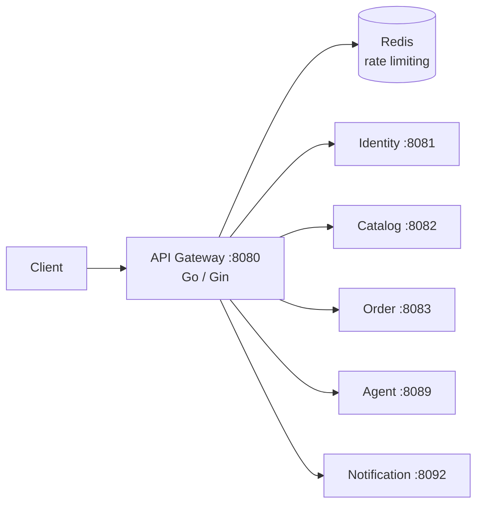

# API Gateway

The API gateway is the single edge entry point for all client traffic. It is a Go/Gin service on port `8080` that terminates JWT auth, sanitizes and injects identity headers, rate-limits, and proxies requests directly to domain services.

## Responsibilities

- Validate JWT access tokens and resolve the caller's identity and role.
- Strip any client-supplied `X-User-ID`, `X-User-Role`, or `X-User-Email` headers before forwarding, then inject verified values from the validated token.
- Assign/propagate `X-Request-ID` and `X-Correlation-ID` on every request and response.
- Rate-limit requests using Redis.
- Route all traffic directly to the owning domain service. The legacy `/bff/admin/*` prefix is retained for admin/analytics callers and forwards straight to domain services (no BFF process exists).

## Architecture

## Request flow

1. Client request hits the gateway with an optional bearer token.
2. `RequestIDMiddleware` assigns/normalizes `X-Request-ID` and `X-Correlation-ID`.
3. JWT middleware validates the token and resolves user ID/role (public routes skip this).
4. Any inbound `X-User-*` headers from the client are stripped; verified `X-User-ID`/`X-User-Role` are injected for downstream services.
5. Rate limiter checks Redis before the request is proxied.
6. Request is proxied to the owning domain service (`/internal/*` paths are blocked with 403).

## HTTP surface

Public routes are proxied under `/auth`, `/products`, `/categories`, `/coupons/validate`, `/stripe/webhook`. Authenticated routes add `/users`, `/cart`, `/orders`, `/payment`, `/shipping/rates`, `/inventory/:productId`, `/coupons/:code`. Admin routes add writes plus `/bff/admin/*` (dashboard, reports, CRUD). Operational routes:

| Route | Purpose | Access |
| --- | --- | --- |
| `GET /health`, `/health/live`, `/health/ready` | Liveness/readiness | Public |

API docs UI runs separately at http://localhost:8099 (Swagger UI container).

## Configuration

Configure `JWT_SECRET`, `REDIS_HOST`/`REDIS_PORT`, `ALLOWED_ORIGINS` (CORS), `INTERNAL_SERVICE_TOKEN`, and downstream service base URLs. Run locally with `go run .` from this directory or through the backend Compose stack.
