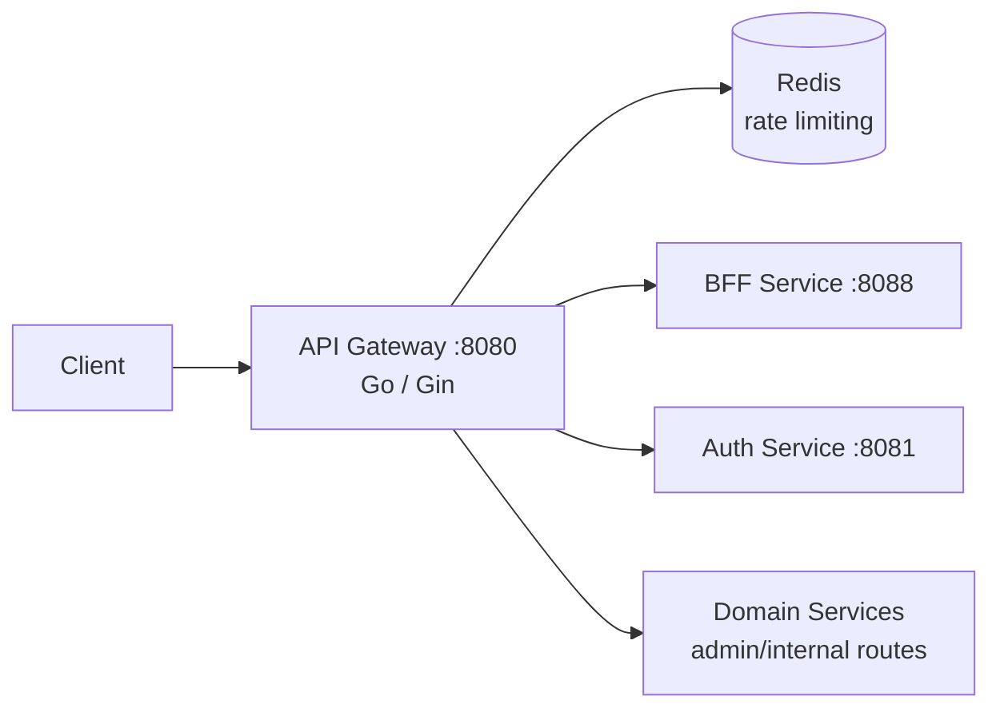

# API Gateway

The API gateway is the single edge entry point for all client traffic. It is a Go/Gin service on port `8080` that terminates JWT auth, sanitizes and injects identity headers, rate-limits, and proxies requests to the BFF service and, for admin/internal routes, directly to domain services.

## Responsibilities

- Validate JWT access tokens and resolve the caller's identity and role.
- Strip any client-supplied `X-User-ID`, `X-User-Role`, or `X-User-Email` headers before forwarding, then inject verified values from the validated token.
- Assign/propagate `X-Request-ID` and `X-Correlation-ID` on every request and response.
- Rate-limit requests using Redis.
- Route public/customer traffic to the BFF service (`:8088`) and admin/internal traffic directly to domain services.
- Serve the aggregated Swagger/OpenAPI docs UI.

## Architecture

## Request flow

1. Client request hits the gateway with an optional bearer token.
2. `RequestIDMiddleware` assigns/normalizes `X-Request-ID` and `X-Correlation-ID`.
3. JWT middleware validates the token and resolves user ID/role (public routes skip this).
4. Any inbound `X-User-*` headers from the client are stripped; verified `X-User-ID`/`X-User-Role` are injected for downstream services.
5. Rate limiter checks Redis before the request is proxied.
6. Request is proxied to BFF (customer-facing routes) or directly to the owning domain service (admin/internal routes).

## HTTP surface

Public routes are proxied under `/auth`, `/products`, `/categories`, `/coupons`, `/cart`, `/checkout`, `/orders`, `/profile`, `/users`, `/payment`, `/promotions`, `/shipping`, `/notifications`, and `/stripe/webhook`. Authenticated and admin variants of these are gated by JWT and role checks respectively. Operational routes:

| Route | Purpose | Access |
| --- | --- | --- |
| `GET /health`, `/health/live`, `/health/ready` | Liveness/readiness | Public |
| `GET /docs`, `/docs/*any` | Swagger/OpenAPI docs UI | Public |

## Configuration

Configure `JWT_SECRET`, `REDIS_HOST`/`REDIS_PORT`, `ALLOWED_ORIGINS` (CORS), `INTERNAL_SERVICE_TOKEN`, and downstream service base URLs (BFF and each domain service). Run locally with `go run .` from this directory or through the backend Compose stack.
