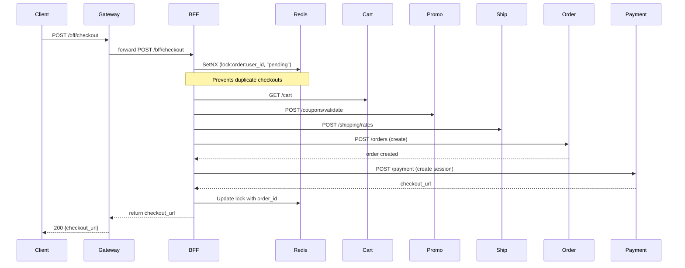
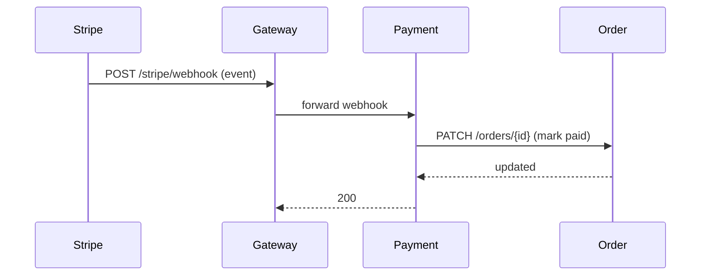

# Backend Architecture

This document describes the high-level architecture of the E-Commerce backend and how components interact.

## Overview diagram (Mermaid)

```mermaid
flowchart LR
  subgraph Users
    U[Frontend / Client]
  end

  subgraph Edge
    API[API Gateway]\n(http://localhost:8080)
  end

  subgraph BFF_Service
    BFF[BFF Service]\n(http://localhost:8088)
  end

  subgraph Services
    AUTH[Auth Service]\n(USER)[User Service]\n    PROD[Product Service]\n    CART[Cart Service]\n    ORDER[Order Service]\n    PAYMENT[Payment Service]\n    INVENT[Inventory Service]\n    PROMO[Promotion Service]\n    SHIP[Shipping Service]
  end

  subgraph Infrastructure
    PG[(Postgres)]
    REDIS[(Redis)]
    S3[(S3 / Localstack S3)]
    SQS[(SQS / Localstack)]
    DDB[(DynamoDB - optional)]
    CW[CloudWatch]
    STRIPE[(Stripe)]
  end

  U -->|HTTP /cookies| API
  API -->|proxy| BFF
  API -->|proxy| AUTH
  API -->|proxy| USER
  API -->|proxy| PROD
  API -->|proxy| CART
  API -->|proxy| ORDER
  API -->|proxy| PAYMENT
  API -->|proxy| INVENT
  API -->|proxy| PROMO
  API -->|proxy| SHIP

  BFF -->|calls| PROD
  BFF -->|calls| CART
  BFF -->|calls| ORDER
  BFF -->|calls| PAYMENT
  BFF -->|calls| AUTH
  BFF -->|calls| PROMO
  BFF -->|calls| SHIP
  BFF -->|idempotency/cache| REDIS

  CART -->|store| REDIS
  CART -->|writes| PG
  ORDER -->|writes/read| PG
  AUTH -->|writes| PG
  USER -->|writes| PG
  PROMO -->|writes| PG
  SHIP -->|writes| PG

  PROD -->|media| S3
  PROD -->|category lookup| DDB

  PAYMENT -->|publishes| SQS
  PAYMENT -->|webhook| STRIPE
  PAYMENT -->|stores| PG

  PROMO -->|events| SQS
  INVENT -->|events| SQS
  ORDER -->|reserve| INVENT

  ALL_SERVICES([All services]) -->|logs/metrics| CW

  click API "http://localhost:8080" "API Gateway"
  click BFF "http://localhost:8088/docs" "BFF Docs"
```

## Narrative

- Clients (web/mobile) talk to the **API Gateway** at `http://localhost:8080`. The gateway forwards requests to backend services and preserves cookies and identity headers.
- The **BFF** (`/bff`) aggregates frontend needs (home page, profile, checkout) by calling core services. It uses **Redis** for distributed locking (idempotency) during checkout to prevent race conditions.
- **Auth**, **User**, **Order**, **Promotion**, **Shipping**, and **Cart** services persist user and transactional data in Postgres.
- **Promotion Service** manages coupon validation and atomically tracks usage limits via DB constraints.
- **Shipping Service** calculates dynamic shipping rates locally using a zone-based engine (zero external API dependency).
- **Payment** integrates with Stripe and receives webhook events; it also publishes/consumes messages via SQS for async workflows.
- **LocalStack** (in local dev) emulates SQS/SNS/DynamoDB/S3 where used.

## Sequence diagrams

### Checkout sequence (Optimized)



### Payment flow (webhook confirmation)


