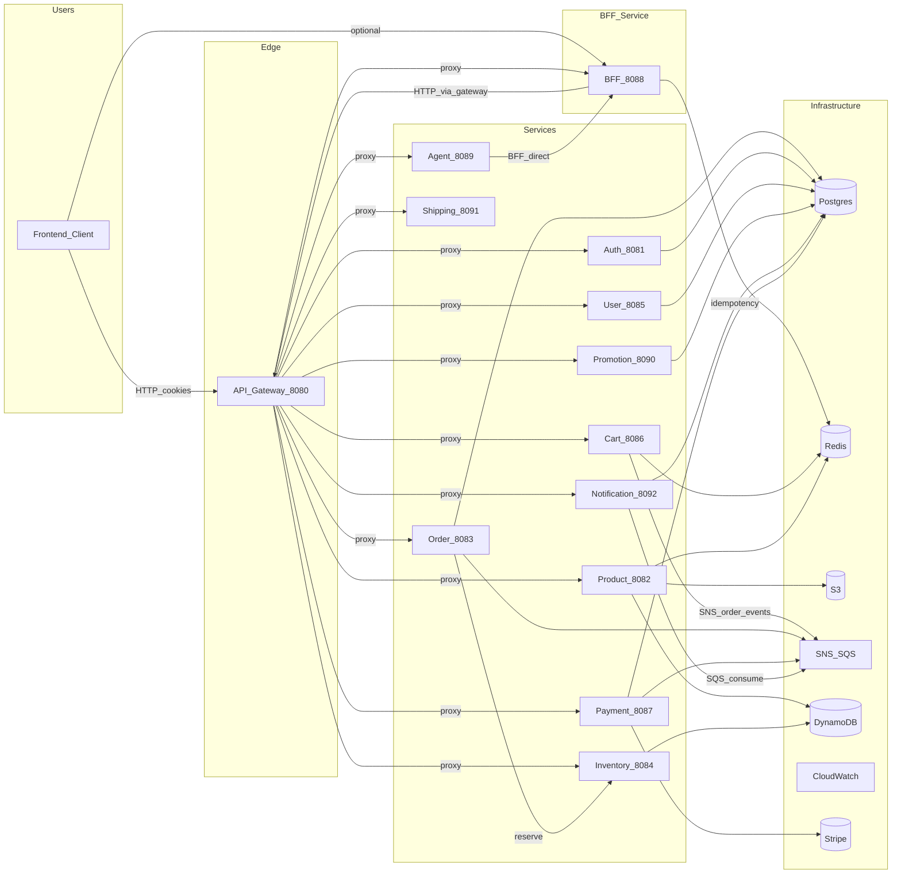
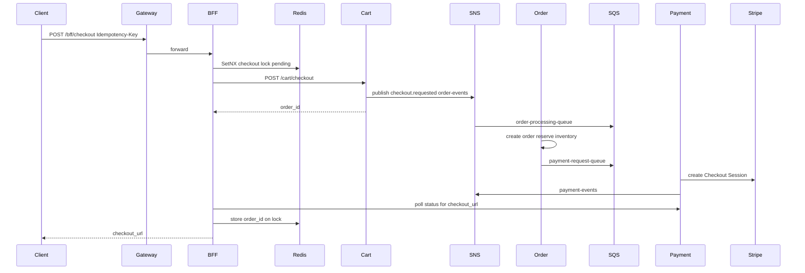
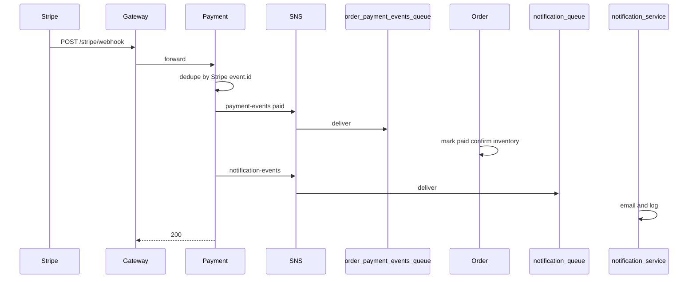

# Backend Architecture

High-level architecture of the ShopSwift e-commerce backend and how components interact.

Related: [data-and-messaging.md](./data-and-messaging.md) · [best-practices-and-gaps.md](./best-practices-and-gaps.md) · [api/README.md](./api/README.md)

## Overview diagram

Source also maintained in [architecture.mmd](./architecture.mmd).

## Narrative

- Clients talk to the **API Gateway** (`:8080`). The gateway proxies many services **directly** and also fronts the **BFF** (`/bff`).
- The **BFF** (`:8088`) aggregates home/profile/checkout. Checkout uses a Redis **SetNX** lock keyed by `Idempotency-Key`, then drives an **async** cart → SNS/SQS → order → payment flow and polls for a Stripe `checkout_url`.
- **Postgres:** auth (identity + refresh tokens), user (profile + addresses), order, payment, promotion (coupons), notification logs.
- **DynamoDB:** product catalog, categories, inventory (primary — not optional).
- **Redis:** cart state, BFF checkout locks, gateway rate limiting, product cache.
- **Shipping** computes rates only (zone/static JSON); it does **not** write Postgres at runtime.
- **Cart** is Redis-only (no Postgres writes).
- **Notification** consumes `notification-queue` (SNS `notification-events`) and sends email / logs.
- **Agent** (Python) calls BFF directly to avoid gateway circularity; needs an LLM endpoint.
- **LocalStack** emulates S3/SNS/SQS/DynamoDB locally — required for local AWS-dependent services.

## Sequence diagrams

### Checkout (async SNS/SQS)

### Payment webhook confirmation

### Idempotency keys

| Hop | Mechanism |
|-----|-----------|
| Client → BFF | Required `Idempotency-Key` header + Redis SetNX |
| Cart → Order | Order `idempotency_key` unique; SQS consumer dedups |
| Payment request | Payment `idempotency_key` unique |
| Stripe webhook | Stored Stripe `event.id` (processed events) |
