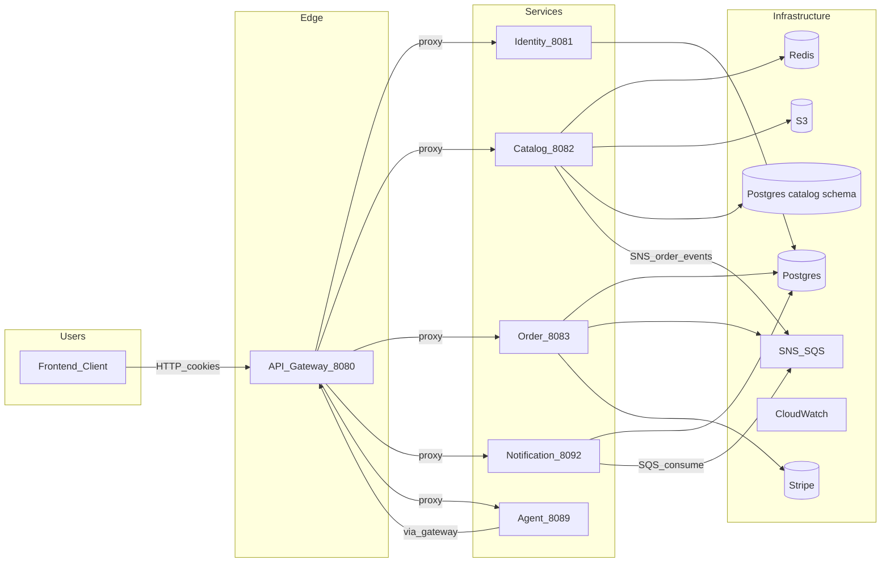
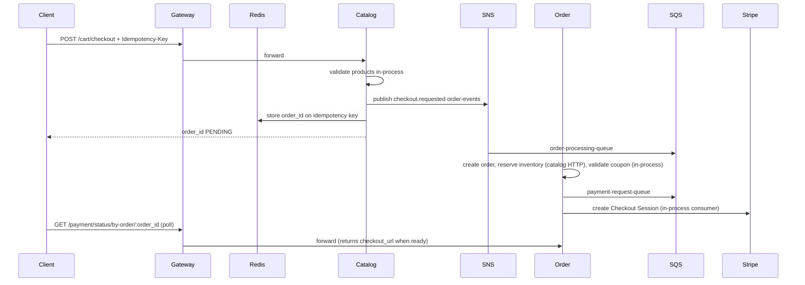
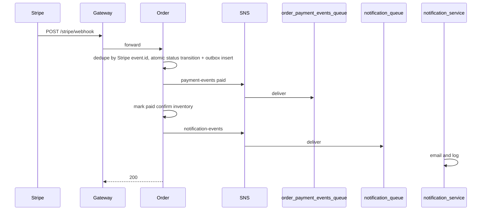

# Backend Architecture

High-level architecture of the ShopSwift e-commerce backend and how components interact.

Related: [data-and-messaging.md](./data-and-messaging.md) · [best-practices-and-gaps.md](./best-practices-and-gaps.md) · [api/README.md](./api/README.md)

## Overview diagram

```mermaid
flowchart LR
  subgraph Users
    U[Frontend_Client]
  end

  subgraph Edge
    API[API_Gateway_8080]
  end

  subgraph Services
    IDENT[Identity_8081]
    CATALOG[Catalog_8082]
    ORDER[Order_8083]
    NOTIF[Notification_8092]
    AGENT[Agent_8089]
  end

  subgraph Infrastructure
    PG[(Postgres)]
    REDIS[(Redis)]
    S3[(S3)]
    SNS_SQS[SNS_SQS]
    DDB[(Postgres catalog schema)]
    CW[CloudWatch]
    STRIPE[(Stripe)]
  end

  U -->|HTTP_cookies| API
  API -->|proxy| IDENT
  API -->|proxy| CATALOG
  API -->|proxy| ORDER
  API -->|proxy| NOTIF
  API -->|proxy| AGENT

  CATALOG --> REDIS
  ORDER --> PG
  IDENT --> PG
  NOTIF --> PG

  CATALOG --> S3
  CATALOG --> DDB

  CATALOG -->|SNS_order_events| SNS_SQS
  ORDER --> SNS_SQS
  ORDER --> STRIPE
  NOTIF -->|SQS_consume| SNS_SQS

  AGENT -->|via_gateway| API
```

Source also maintained in [architecture.mmd](./architecture.mmd).

## Narrative

- Clients talk to the **API Gateway** (`:8080`), which proxies all services directly. There is no BFF: storefront pages call domain routes (`GET /products` + `/categories`, `GET /cart`, `POST /cart/checkout` then poll `GET /payment/status/by-order/:order_id`).
- **Identity** (`:8081`) owns credentials, JWT refresh, profiles, addresses (Postgres `users`, `refresh_tokens`, `addresses`).
- **Catalog** (`:8082`) owns the product catalogue, categories, S3 images, bulk import (Postgres + S3 + Redis cache), stock levels and reservations (Postgres `catalog.inventory` / `catalog.stock_reservations`), and the Redis cart (`cart:user:{id}`, `idem:cart:*`).
- **Order** (`:8083`) owns orders, coupons, zone shipping rates, and Stripe payments (Postgres `orders`, `order_items`, `coupons`, `payments`, `stripe_processed_events`, outbox tables). Checkout → Stripe → webhook fulfillment runs in-process; cross-binary hops remain only where binaries differ (catalog inventory/product reads, SNS to SQS queues).
- **Postgres:** identity, order, notification logs.
- **Postgres `catalog` schema:** product catalog, categories, inventory and stock reservations (owned by catalog-service, accessed as role `catalog_svc` in production).
- **Redis:** cart state, cart idempotency keys, gateway rate limiting, product cache, bulk-import queue.
- **Notification** consumes `notification-queue` (SNS `notification-events`) and sends email / logs.
- **Agent** (Python) calls domain and `/bff/admin/*` analytics paths through the gateway; needs an LLM endpoint.
- **LocalStack** emulates S3/SNS/SQS locally — required for local AWS-dependent services.

## Sequence diagrams

### Checkout (async SNS/SQS)

```mermaid
sequenceDiagram
  participant Client
  participant Gateway
  participant Redis
  participant Catalog
  participant SNS
  participant Order
  participant SQS
  participant Stripe

  Client->>Gateway: POST /cart/checkout + Idempotency-Key
  Gateway->>Catalog: forward
  Catalog->>Catalog: validate products in-process
  Catalog->>SNS: publish checkout.requested order-events
  Catalog->>Redis: store order_id on idempotency key
  Catalog-->>Client: order_id PENDING
  SNS->>SQS: order-processing-queue
  Order->>Order: create order, reserve inventory (catalog HTTP), validate coupon (in-process)
  Order->>SQS: payment-request-queue
  Order->>Stripe: create Checkout Session (in-process consumer)
  Client->>Gateway: GET /payment/status/by-order/:order_id (poll)
  Gateway->>Order: forward (returns checkout_url when ready)
```

### Payment webhook confirmation

```mermaid
sequenceDiagram
  participant Stripe
  participant Gateway
  participant Order
  participant SNS
  participant OrderSQS as order_payment_events_queue
  participant NotifQ as notification_queue
  participant Notif as notification_service

  Stripe->>Gateway: POST /stripe/webhook
  Gateway->>Order: forward
  Order->>Order: dedupe by Stripe event.id, atomic status transition + outbox insert
  Order->>SNS: payment-events paid
  SNS->>OrderSQS: deliver
  Order->>Order: mark paid confirm inventory
  Order->>SNS: notification-events
  SNS->>NotifQ: deliver
  Notif->>Notif: email and log
  Order-->>Gateway: 200
```

### Idempotency keys

| Hop | Mechanism |
|-----|-----------|
| Client → Cart | `Idempotency-Key` header, hashed + user-scoped (`idem:cart:*`) with cached replay |
| Cart → Order | Order `idempotency_key` unique; SQS consumer dedups |
| Payment request | Payment `idempotency_key` unique |
| Stripe webhook | Stored Stripe `event.id` (processed events) |
