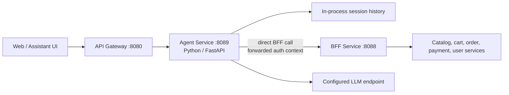
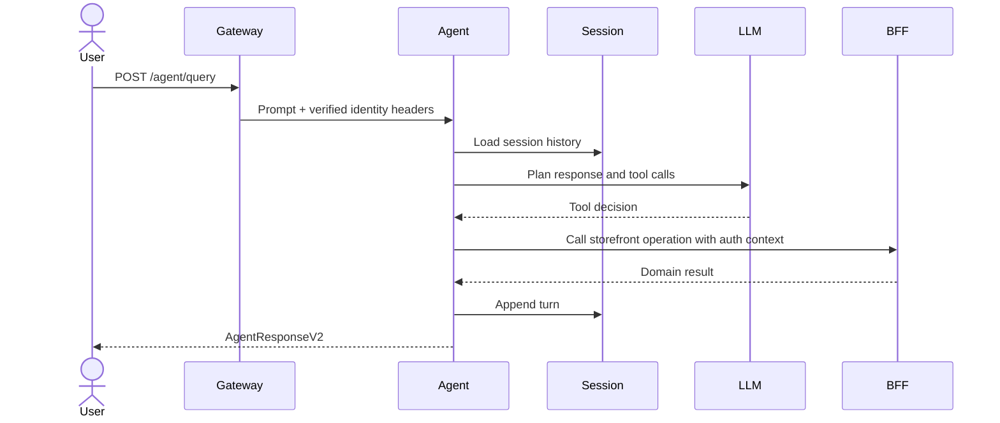

# Agent Service

The agent service is the Python/FastAPI conversational interface for ShopSwift. It runs on port `8089`, keeps short-lived in-process session history, and calls the BFF directly to execute storefront operations on behalf of the authenticated user.

## Responsibilities

- Accept natural-language queries and maintain a session conversation.
- Select and invoke tools registered by the agent runtime.
- Forward authorization, cookies, `X-User-ID`, `X-User-Role`, and correlation IDs to the BFF.
- Expose session inspection and clearing for controlled clients.
- Provide health and tool-discovery endpoints.

## Architecture

The direct Agent-to-BFF path avoids sending the agent through a gateway route that could create a routing loop. The service is stateless across process restarts: session history is local memory and is not a durable customer record.

## Query flow

## HTTP surface

| Route | Purpose | Access |
| --- | --- | --- |
| `POST /agent/query` | Run an agent query | Gateway-authenticated or guest context |
| `GET /agent/session/:session_id` | Inspect in-memory history | Controlled/internal use |
| `DELETE /agent/session/:session_id` | Clear session history | Controlled/internal use |
| `GET /tools` and `GET /agent/tools` | List registered tools | Public/runtime discovery |
| `GET /health` | Health status and version | Public |

## Configuration and safety

Configure the BFF base URL, LLM endpoint and credentials, request timeouts, and logging. Preserve correlation IDs across downstream calls. Do not persist tokens or sensitive prompts in session logs; session memory should be treated as ephemeral process state.
