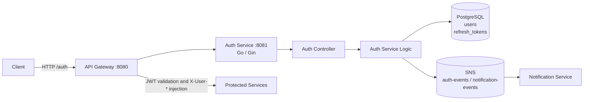
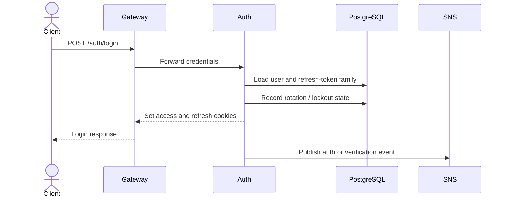

# Auth Service

The auth service owns ShopSwift identity and session credentials. It is a Go/Gin service on port `8081` and is normally reached through the API Gateway at `/auth` or through the BFF auth proxy.

## Responsibilities

- Register users as `role=user`, validate password strength, and initiate email verification.
- Authenticate users and issue short-lived JWT access tokens plus rotating refresh tokens.
- Store authentication fields, refresh-token families, verification state, and login lockout state.
- Logout and revoke refresh tokens, including revoking tokens through an internal service endpoint.
- Bootstrap one verified administrator from `ADMIN_EMAIL` and `ADMIN_PASSWORD` when no admin exists.
- Publish authentication and verification events for notification workflows.

## Architecture

The gateway validates access JWTs for downstream requests. The auth service remains the source of truth for credentials and refresh-token rotation. The client receives tokens in secure cookies; the gateway converts the verified JWT claims into sanitized `X-User-ID`, `X-User-Role`, and `X-User-Email` headers.

## Request flows

## HTTP surface

| Route | Purpose | Access |
| --- | --- | --- |
| `POST /auth/register` | Create a normal user and send verification | Public |
| `POST /auth/login` | Authenticate and set session cookies | Public |
| `POST /auth/verify-email` | Verify an email code | Public |
| `POST /auth/resend-verification` | Send a new verification code | Public |
| `POST /auth/refresh` | Rotate the refresh-token family | Refresh cookie |
| `POST /auth/logout` | Revoke the presented refresh token and clear cookies | Public/session |
| `GET /auth/status` | Return the current authenticated identity | Authenticated |
| `POST /auth/admin/users` | Provision an administrator | Admin |
| `POST /auth/internal/revoke-user-tokens` | Revoke tokens after a password change | Internal service token |

## Persistence and security

The service uses GORM with PostgreSQL tables `users` and `refresh_tokens`. Schema changes should be applied through `backend/migrations`; `ALLOW_AUTO_MIGRATE` is intended for local development only. Registration ignores a client-supplied role. Refresh operations reload the current role from the database, so role changes take effect on the next refresh. Internal routes require `INTERNAL_SERVICE_TOKEN`.

## Configuration

Important variables include `POSTGRES_*`, `JWT_SECRET`, `ADMIN_EMAIL`, `ADMIN_PASSWORD`, `COOKIE_DOMAIN`, `COOKIE_CROSS_ORIGIN`, `ENV`, `ALLOW_AUTO_MIGRATE`, and the SNS/LocalStack settings. Run locally with `go run .` from this directory or through the backend Compose stack.
