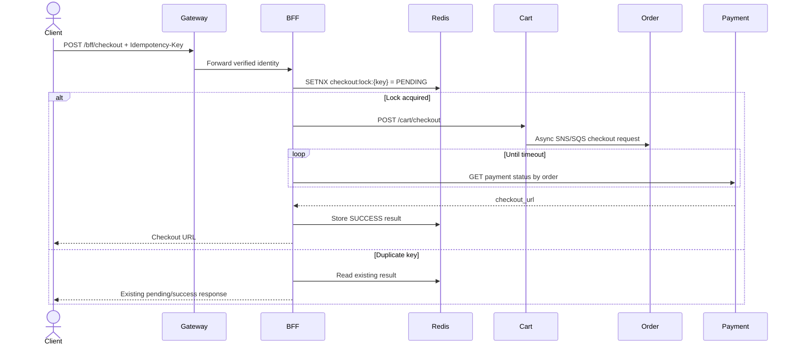

# BFF Service

The backend-for-frontend (BFF) is the storefront orchestration layer on port `8088`. It aggregates domain responses for the web client, forwards identity, and coordinates asynchronous checkout without taking ownership of domain data.

## Responsibilities

- Forward `X-Request-ID` and `X-Correlation-ID` together on downstream HTTP calls.

## Architecture

```mermaid
flowchart LR
  Client[Web / Mobile] --> Gateway[API Gateway :8080]
  Gateway --> BFF[BFF Service :8088\nGo / Gin]
  BFF -->|gateway HTTP client| Gateway
  BFF --> Redis[(Redis\ncheckout:lock:{key})]
  BFF --> Cart[Cart Service :8086]
  BFF --> Order[Order Service :8083]
  BFF --> Payment[Payment Service :8087]
  BFF --> Product[Product Service :8082]
  BFF --> User[User Service :8085]
  BFF --> Promo[Promotion Service :8090]
```

The gateway remains the normal edge entry point. The BFF calls the gateway-facing service routes so auth, correlation, and routing behavior stay consistent. It does not replace domain-service ownership.

## Checkout orchestration



## HTTP surface

| Route group | Examples | Access |
| --- | --- | --- |
| Public `/bff` | auth register/login/verify/refresh, products, categories, home, guest coupon validation | Public |
| Protected `/bff` | auth logout/status, cart, checkout, orders, profile, payment status, promotions | Authenticated |
| Admin `/bff/admin` | promotion management and bulk category operations | Admin |
| Health | `/health`, `/health/live`, `/health/ready` | Public |

## Reliability and configuration

The `Idempotency-Key` header is required for checkout. Redis locks have a TTL and store the eventual result so client retries do not create duplicate orders. Configure gateway URL, downstream timeouts, Redis, checkout polling interval/timeout, and cookie/header forwarding settings.
