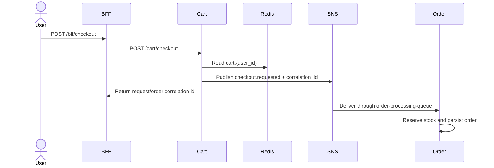

# Cart Service

The cart service owns the active shopping cart for each user. It is a Go/Gin service on port `8086` and stores cart JSON exclusively in Redis.

## Responsibilities

- Read, add to, remove from, and clear a user cart.
- Apply a coupon code to the cart workflow.
- Publish a checkout request without synchronously creating an order, retaining correlation metadata for downstream consumers.
- Validate all checkout products with one authenticated batch request.
- Enforce that every request carries a gateway-authenticated `X-User-ID`.
- Expire inactive cart state using the configured cart TTL.

## Architecture

```mermaid
flowchart LR
  Client[Storefront] --> Gateway[API Gateway :8080]
  Gateway --> Cart[Cart Service :8086\nGo / Gin]
  Cart --> Redis[(Redis\ncart:{user_id})]
  Cart -->|checkout.requested| SNS[(SNS order-events)]
  SNS --> Queue[SQS order-processing-queue]
  Queue --> Order[Order Service :8083]
  Cart -.-> Promo[Promotion Service :8090\nvia checkout validation]
```

## Checkout flow



## HTTP surface

| Route | Purpose |
| --- | --- |
| `GET /cart/` | Read the current user cart |
| `POST /cart/add` | Add or update cart items |
| `DELETE /cart/remove/:product_id` | Remove one product |
| `DELETE /cart/clear` | Empty the cart |
| `POST /cart/coupon` | Apply or validate a coupon in cart context |
| `POST /cart/checkout` | Publish the checkout request |

All routes are protected by the service-side user gate as well as gateway authentication. The service derives the Redis key from `X-User-ID`; clients must not be allowed to choose another user's key.

## Data and messaging

Redis stores `cart:{user_id}` with a configurable TTL. The service does not write cart rows to Postgres. Checkout publishes to SNS topic `order-events`; the order service consumes the resulting `order-processing-queue` message and owns order creation.

## Configuration

Configure Redis, `CART_TTL`, AWS region/credentials, SNS topic settings, and LocalStack endpoint. The cart service can run without Postgres.
