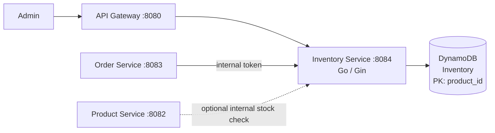
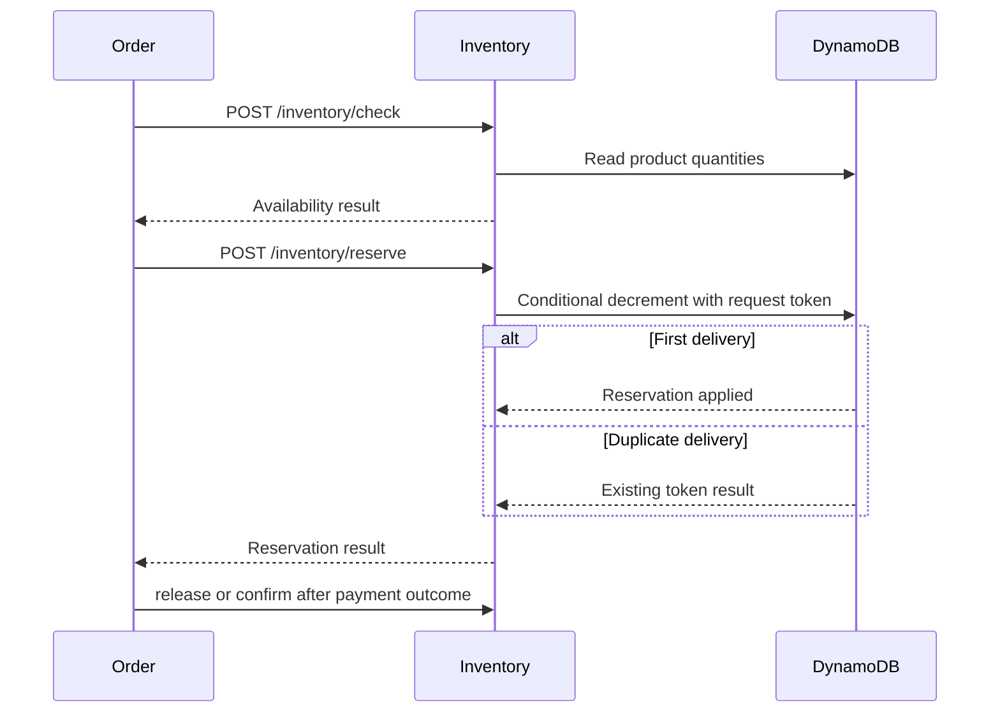

# Inventory Service

The inventory service owns real-time stock and reservation state. It is a Go/Gin service on port `8084` backed by DynamoDB and is called by administrators and internal order-processing flows.

## Responsibilities

- Read stock for one product or list stock for administrators.
- Set and update stock from the admin catalog workflow.
- Check, reserve, release, and confirm stock for an order.
- Make reservation operations idempotent with conditional DynamoDB updates and client request tokens.
- Keep inventory ownership separate from product catalog ownership.

## Architecture

Admin routes use the gateway identity and require `role=admin`. Reservation routes are mesh endpoints protected by `INTERNAL_SERVICE_TOKEN`; they are not general client APIs.

## Reservation flow

## HTTP surface

| Route | Purpose | Access |
| --- | --- | --- |
| `GET /inventory` | List stock | Admin |
| `POST /inventory` | Set stock | Admin |
| `PUT /inventory/:productId` | Update stock | Admin |
| `GET /inventory/:productId` | Read one stock record | Gateway/service flow |
| `POST /inventory/check` | Check order availability | Internal service token |
| `POST /inventory/reserve` | Reserve quantities | Internal service token |
| `POST /inventory/release` | Release a reservation | Internal service token |
| `POST /inventory/confirm` | Confirm a reservation after payment | Internal service token |

## Persistence and failure behavior

`Inventory` is a DynamoDB table keyed by `product_id`. Writes use conditional expressions so stock cannot become negative. Reservation requests carry an idempotency token; repeated SQS deliveries or order retries return the prior result instead of decrementing stock again. DynamoDB is the runtime source of truth; there is no Postgres inventory table.

## Configuration

Set `DDB_TABLE_INVENTORY`, AWS credentials/region, `USE_LOCALSTACK`, `LOCALSTACK_ENDPOINT`, and `INTERNAL_SERVICE_TOKEN`. The service must be able to reach the same LocalStack or AWS DynamoDB endpoint used by product-service.
