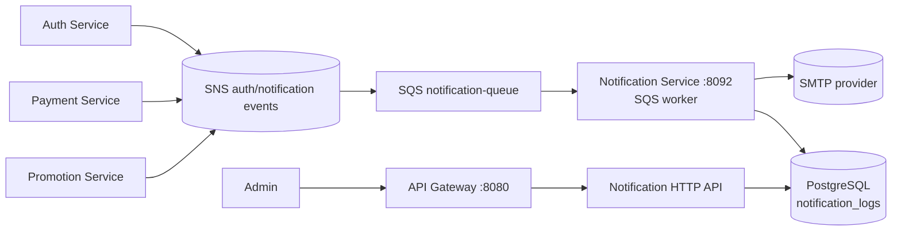

# Notification Service

The notification service consumes asynchronous notification events, sends email, and records delivery attempts. It is a Go/Gin service on port `8092` with PostgreSQL logs, SMTP delivery, and an SQS worker.

## Responsibilities

- Consume SNS-wrapped messages from `notification-queue`.
- Render and send transactional email through the configured SMTP sender.
- Persist successful and failed delivery attempts in `notification_logs`.
- Retry failed messages by leaving them available to SQS retry/DLQ policy.
- Deduplicate delivered notification events by stable `event_id`; failed deliveries release their claim and remain retryable.
- Expose an admin-only log inspection endpoint.

## Architecture



## Consumer flow

```mermaid
sequenceDiagram
  participant SNS
  participant Queue as notification-queue
  participant Worker as Notification worker
  participant SMTP
  participant DB as PostgreSQL

  SNS->>Queue: Publish notification event
  Queue->>Worker: Deliver message
  Worker->>SMTP: Send email
  alt Send succeeds
    Worker->>DB: Insert success log
    Worker->>Queue: Delete message
  else Send fails
    Worker->>DB: Insert failure log
    Worker-->>Queue: Do not delete; retry/DLQ policy applies
  end
```

## HTTP surface

| Route | Purpose | Access |
| --- | --- | --- |
| `GET /notifications/log` | Inspect notification delivery logs | Admin |
| `GET /health`, `/health/live`, `/health/ready` | Liveness/readiness | Public |

## Data and operations

`notification_logs` is owned by this service. Successful messages are acknowledged only after email handling and logging complete. Failures remain retryable; configure queue visibility timeout, retry count, and DLQ policy to avoid losing events while preventing poison-message loops.

## Configuration

Set Postgres, SMTP host/port/user/password/from address, SQS queue URL, SNS/LocalStack settings, and service authentication. Apply the notification-log migration before enabling the worker.
