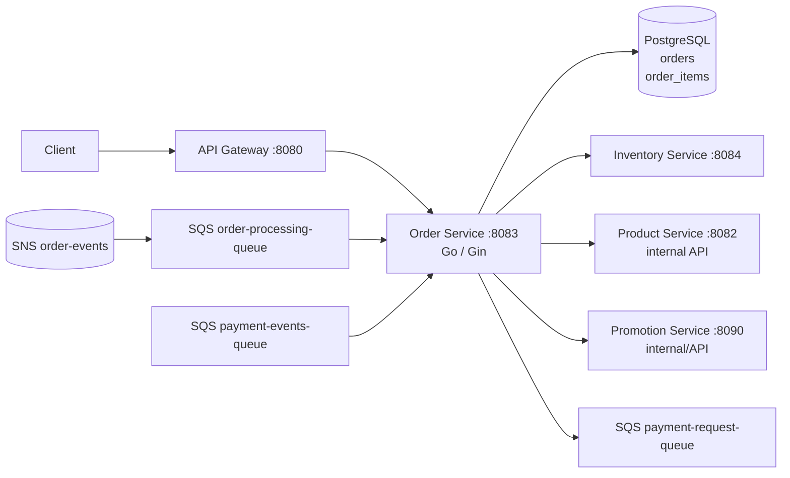
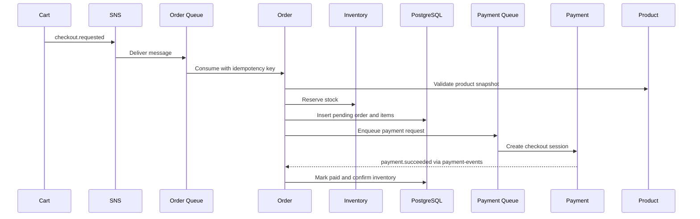

# Order Service

The order service owns order state, order items, checkout consumption, stock orchestration, and payment dispatch. It is a Go/Gin service on port `8083` with PostgreSQL persistence and SQS consumers.

## Responsibilities

- Consume checkout requests and create idempotent orders.
- Validate products and coupons through internal service clients.
- Reserve inventory before finalizing the order's pending state.
- Dispatch payment requests and consume payment events.
- Confirm or cancel orders and release inventory when payment fails.
- Expose customer order history and admin order/revenue views.

## Architecture

## Checkout and payment flow

## HTTP surface

| Route | Purpose | Access |
| --- | --- | --- |
| `GET /orders/` | List the current user's orders | Authenticated |
| `GET /orders/:id` | Read one owned order | Authenticated |
| `GET /orders/admin/` | List all orders | Admin |
| `GET /orders/admin/stats` | Read revenue/order statistics | Admin |

## Persistence and idempotency

PostgreSQL tables `orders` and `order_items` belong exclusively to this service. Checkout consumers deduplicate on the order idempotency key. Inventory operations are tokenized; payment-event handling checks order state before applying a terminal transition. SQS consumers must be safe to retry because acknowledgement happens only after successful processing.

## Configuration

Configure Postgres, AWS SQS/SNS, internal service URLs, `INTERNAL_SERVICE_TOKEN`, and product/inventory/promotion client settings. Apply migrations from `backend/migrations` before starting in production.
