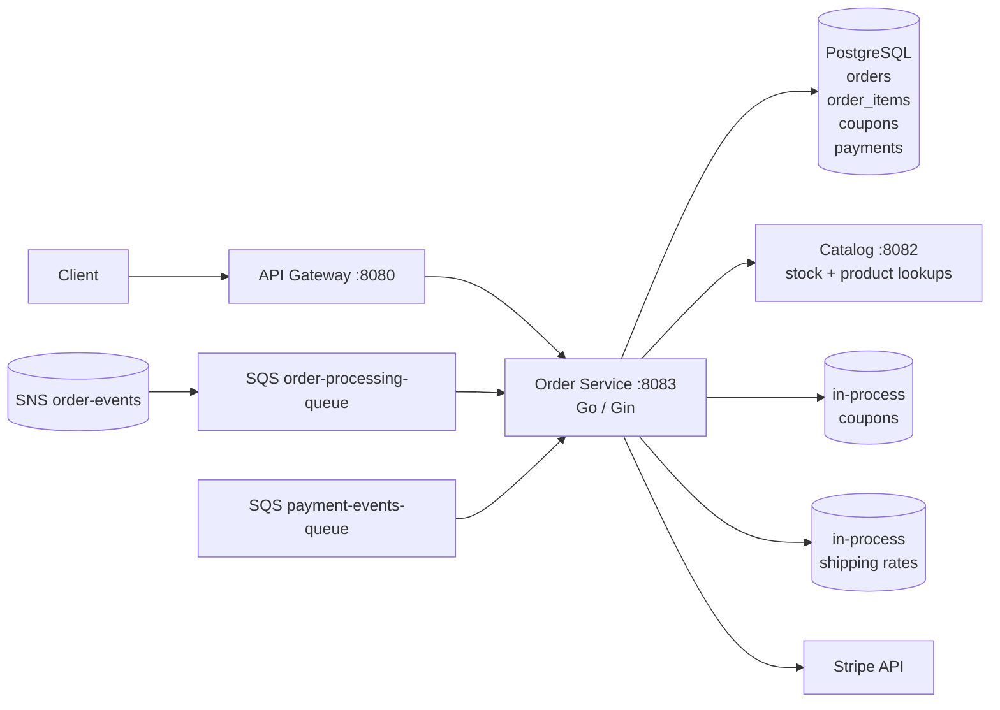

# Order Service

The order service owns orders, coupons, shipping rates, and payments. It is a Go/Gin service on port `8083` with PostgreSQL persistence and SQS consumers. It absorbed promotion-service, shipping-service, and payment-service; all three now run in-process.

## Responsibilities

- Consume checkout requests and create idempotent orders.
- Validate products and coupons in-process (no inter-service hop).
- Calculate zone shipping rates in-process.
- Reserve inventory before finalizing the order's pending state.
- Create Stripe Checkout Sessions, ingest Stripe webhooks, and publish payment outcomes via transactional outbox.
- Confirm or cancel orders and release inventory when payment fails.
- Expose customer order history and admin order/revenue views.
- Preserve checkout correlation IDs in payment and notification outbox payloads, including retry/redelivery paths.

## Architecture

```mermaid
flowchart LR
  Client[Client] --> Gateway[API Gateway :8080]
  Gateway --> Order[Order Service :8083\nGo / Gin]
  SNS[(SNS order-events)] --> CheckoutQ[SQS order-processing-queue]
  CheckoutQ --> Order
  Order --> PG[(PostgreSQL\norders\norder_items\ncoupons\npayments)]
  Order --> Catalog[Catalog :8082\nstock + product lookups]
  Order --> Coupons[(in-process\ncoupons)]
  Order --> Shipping[(in-process\nshipping rates)]
  Order --> Stripe[Stripe API]
  PaymentEvents[SQS payment-events-queue] --> Order
```

## Checkout and payment flow

```mermaid
sequenceDiagram
  participant Cart
  participant SNS
  participant CheckoutQ as Order Queue
  participant Order
  participant Inventory
  participant DB as PostgreSQL
  participant PaymentQ as Payment Queue
  participant Payment

  Cart->>SNS: checkout.requested
  SNS->>CheckoutQ: Deliver message
  CheckoutQ->>Order: Consume with idempotency key
  Order->>Product: Validate product snapshot
  Order->>Inventory: Reserve stock
  Order->>DB: Insert pending order and items (+ coupon + payment rows)
  Order->>Stripe: Create checkout session (in-process consumer)
  Stripe-->>Order: webhook → payment.succeeded via outbox
  Order->>DB: Mark paid and confirm inventory

  Checkout correlation metadata is optional for backward compatibility. When order persistence fails after a successful reservation, the consumer releases the reservation before returning the error for retry.
```

## HTTP surface

| Route | Purpose | Access |
| --- | --- | --- |
| `GET /orders/` | List the current user's orders | Authenticated |
| `GET /orders/:id` | Read one owned order | Authenticated |
| `PUT /orders/:id/cancel` | Cancel an order | Admin |
| `GET /orders/admin/` | List all orders | Admin |
| `GET /orders/admin/stats` | Read revenue/order statistics | Admin |
| `POST /coupons/validate` | Validate coupon (guest-friendly) | Public |
| `GET /coupons/:code` | Read coupon | Authenticated |
| `POST /coupons`, `GET /coupons`, `DELETE /coupons/:code` | Manage coupons | Admin |
| `POST /shipping/rates` | Zone shipping rates | Authenticated |
| `GET /payment/status/by-order/:order_id` | Poll payment status | Authenticated |
| `POST /payment/create-checkout`, `POST /payment/verify-payment` | Stripe session ops | Authenticated |
| `POST /stripe/webhook` | Stripe webhook (signature-verified) | Public |

## Persistence and idempotency

PostgreSQL tables `orders`, `order_items`, `coupons`, `payments`, `stripe_processed_events`, and `payment_outbox_events` belong exclusively to this service. Checkout consumers deduplicate on the order idempotency key. Inventory operations are tokenized; payment-event handling checks order state before applying a terminal transition. SQS consumers must be safe to retry because acknowledgement happens only after successful processing.

## Outbox publisher

The order service persists payment-request and order-created events in `outbox_events` in the same transaction as the order. An in-process publisher claims pending events with a lease, sends them to their destination, and marks them published only after AWS confirms the send.

Claims whose lease expires are reclaimable. Publish failures return events to `pending` with exponential backoff. A process crash after AWS accepts a message but before the database update can therefore publish the event again; consumers must remain idempotent because delivery is at least once.

The publisher resolves SQS queue names as needed and supports SNS topic ARNs. It starts with order-service and stops through the service shutdown context.

## Configuration

Configure Postgres, AWS SQS/SNS, `STRIPE_API_KEY` / `STRIPE_WEBHOOK_SECRET` / `FRONTEND_URL`, internal service URLs, `INTERNAL_SERVICE_TOKEN`. Apply migrations from `backend/migrations` before starting in production.
