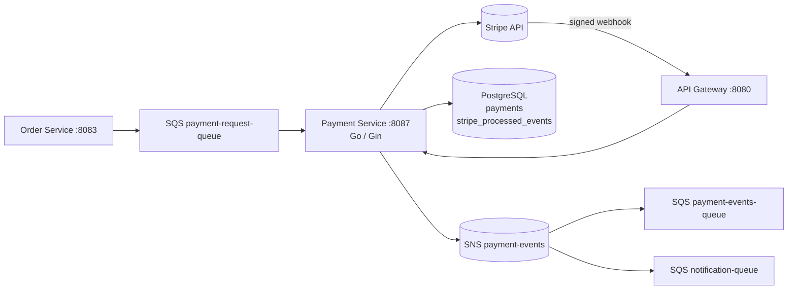
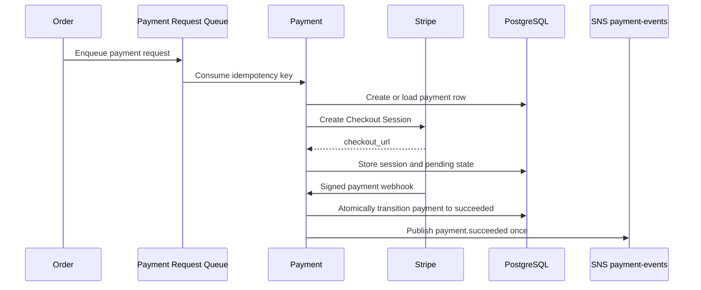

# Payment Service

The payment service owns payment records, Stripe Checkout session creation, webhook verification, and payment event publication. It is a Go/Gin service on port `8087` with a background SQS consumer.

## Responsibilities

- Create Stripe Checkout sessions for pending orders.
- Persist payment state and checkout URLs.
- Verify payment status for authenticated clients.
- Validate Stripe webhook signatures and process terminal transitions once.
- Publish payment success/failure events for order and notification consumers.
- Retry SQS payment requests without creating duplicate payment sessions.
- Deduplicate payment requests by stable `event_id`; legacy messages fall back to `idempotency_key`.

## Architecture

## Payment flow

## HTTP surface

| Route | Purpose | Access |
| --- | --- | --- |
| `GET /payment/status/by-order/:order_id` | Read payment state and checkout URL | Authenticated |
| `POST /payment/create-checkout` | Create a checkout session directly | Authenticated |
| `POST /payment/verify-payment` | Verify a payment status | Authenticated |
| `POST /stripe/webhook` | Receive Stripe events | Stripe signature |
| `GET /health`, `/health/live`, `/health/ready` | Liveness/readiness | Public |

## Persistence and webhook safety

`payments` is the service's payment state; `stripe_processed_events` records Stripe event IDs for audit and deduplication. The payment row transition is guarded so concurrent or repeated webhook deliveries cannot publish fulfillment events twice. The webhook returns an acknowledgement only after signature and processing rules have been applied.

## Configuration

Set Stripe secret/signing keys, frontend URL settings, Postgres, SQS/SNS, AWS/LocalStack, and `INTERNAL_SERVICE_TOKEN` where required. Never expose Stripe secrets to clients or place them in repository configuration.
