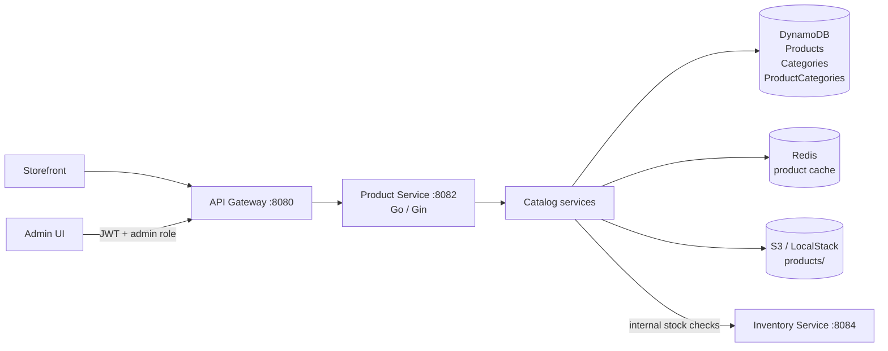
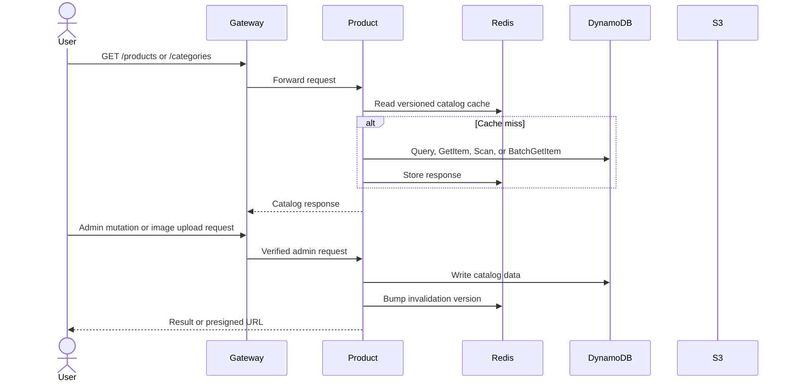

# Product Service

The product service owns the catalog, categories, product-category relationships, and product media upload workflow. It is a Go/Gin service on port `8082`, normally exposed through `/products` and `/categories` at the gateway.

## Responsibilities

- Serve public product and category reads with filtering, featured queries, and category expansion.
- Create, update, soft-delete, and bulk-import products and categories for administrators.
- Maintain the `ProductCategories` adjacency table used for category queries.
- Generate presigned S3 upload URLs for product images.
- Cache catalog responses in Redis and invalidate cache versions after mutations.
- Validate product identifiers and synchronize catalog-related stock checks with inventory-service.

## Architecture

The product service owns all three catalog tables. Inventory is owned by inventory-service; product-service only calls its internal API where a catalog operation needs stock information.

## Read and mutation flow

## HTTP surface

| Route | Purpose | Access |
| --- | --- | --- |
| `GET /products` | List and filter products | Public |
| `GET /products/:id` | Read one product | Public |
| `POST /products` | Create a product | Admin |
| `PUT /products/:id` | Update a product | Admin |
| `DELETE /products/:id` | Soft-delete a product | Admin |
| `GET /products/presign` | Create a general upload URL | Admin |
| `POST /products/:id/images/presign` | Create an image upload URL | Admin |
| `POST /products/bulk/validate` | Validate a bulk import | Admin |
| `POST /products/bulk` | Start a bulk import | Admin |
| `GET /products/bulk/jobs/:id` | Read bulk import status | Admin |
| `POST /products/bulk/delete` | Bulk-delete products | Admin |
| `GET /categories` and `GET /categories/:id` | Read categories | Public |
| `POST /categories`, `PUT /categories/:id`, `DELETE /categories/:id` | Manage categories | Admin |
| `POST /categories/bulk` | Bulk-create categories | Admin |
| `GET /products/internal/:id` | Internal product lookup | Internal service token |
| `POST /products/internal/batch-validate` | Internal batch validation | Internal service token |

## Data model and operations

`Products` uses `id` as its partition key and GSIs for SKU and featured queries. `Categories` uses `id` and a name index. `ProductCategories` maps `category_id` to `product_id` and has a reverse product index. Lists without a supported index use filtered scans; category reads query the adjacency table and batch-get products. Product and category mutations bump cache versions so stale catalog responses are not reused.

## Configuration

Set `DDB_TABLE_PRODUCTS`, `DDB_TABLE_CATEGORIES`, `DDB_TABLE_PRODUCT_CATEGORIES`, `AWS_S3_BUCKET`, `AWS_S3_PREFIX`, Redis settings, and `USE_LOCALSTACK`/`LOCALSTACK_ENDPOINT`. LocalStack must contain the DynamoDB tables and S3 bucket before the service can serve catalog traffic.
