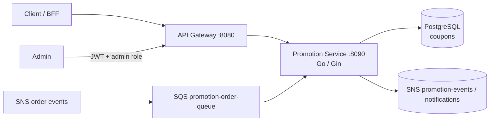
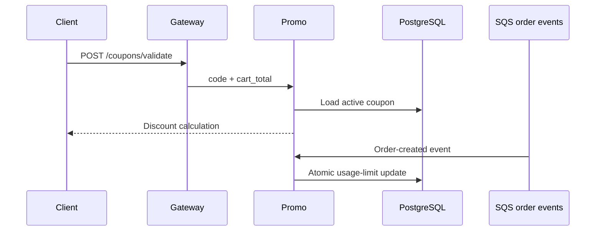

# Promotion Service

The promotion service owns coupon definitions, validation, usage limits, and deactivation. It is a Go/Gin service on port `8090` backed by PostgreSQL and an order-event consumer.

## Responsibilities

- Validate a coupon against cart total, dates, status, and usage limits.
- Return a coupon for authenticated checkout flows.
- Create, list, and deactivate coupons for administrators.
- Atomically consume coupon usage when an order event is finalized; concurrent attempts cannot exceed `usage_limit`.
- Publish promotion-related notification events when configured.

## Architecture

## Coupon flow

## HTTP surface

| Route | Purpose | Access |
| --- | --- | --- |
| `POST /coupons/validate` | Validate a code for a cart | Public, rate-limited at edge |
| `GET /coupons/:code` | Read coupon details | Authenticated |
| `POST /coupons` | Create coupon | Admin |
| `GET /coupons` | List coupons | Admin |
| `DELETE /coupons/:code` | Deactivate coupon | Admin |

## Persistence and consistency

The `coupons` table is owned by this service. Usage increments must be atomic so concurrent orders cannot exceed a coupon's limit. Order-event consumption is retry-safe and should acknowledge an event only after the database transition completes.

## Configuration

Configure Postgres, `ALLOW_AUTO_MIGRATE`, SNS/SQS topic and queue names, AWS/LocalStack settings, and service authentication values. Apply the coupon migration before startup.
