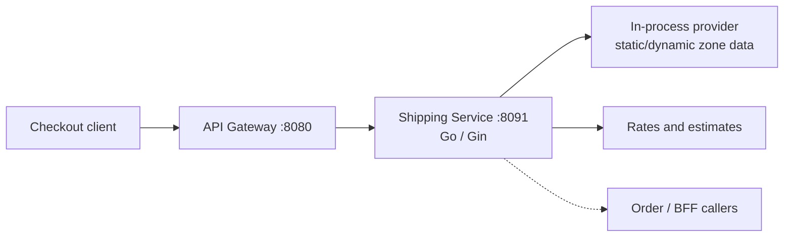
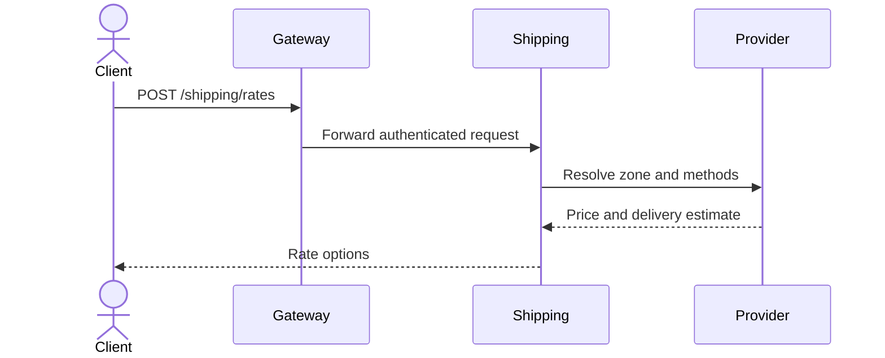

# Shipping Service

The shipping service calculates delivery rates from the request address, zone, cart contents, and configured provider data. It is a Go/Gin service on port `8091` with no runtime database.

## Responsibilities

- Authenticate rate requests.
- Resolve a destination to a shipping zone.
- Calculate available shipping methods, prices, and delivery estimates.
- Keep rate calculation deterministic and independent from order persistence.

## Architecture

There is no Postgres write, shipment consumer, or shipping event publisher in the current runtime implementation. The `shipments` migration is reserved for future ownership and is not used by this service.

## Rate flow

## HTTP surface

| Route | Purpose | Access |
| --- | --- | --- |
| `POST /shipping/rates` | Calculate available shipping rates | Authenticated |

## Configuration and extension

Configure service port, provider data, and auth settings. Keep provider logic behind the provider interface so a live carrier API or persisted shipment model can be introduced without changing the HTTP contract.
