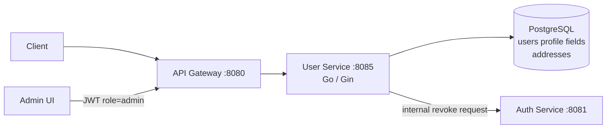
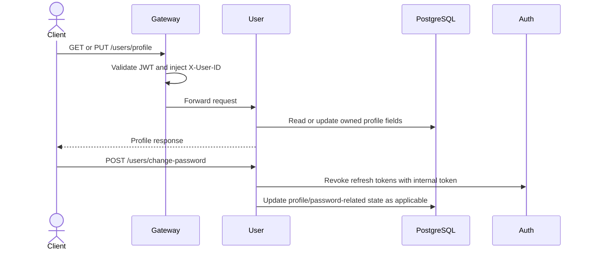

# User Service

The user service owns customer profile and address data. It is a Go/Gin service on port `8085`; authentication credentials remain owned by auth-service even though both services use the shared `users` table for different columns.

## Responsibilities

- Read and update the authenticated user's profile.
- Manage profile password changes by requesting auth-service token revocation.
- Address CRUD routes are not currently registered; address ownership checks are therefore not an active HTTP path.
- Provide an admin-only user listing.
- Enforce gateway-injected identity rather than trusting client-selected user IDs.

## Architecture

Auth-service owns credentials, roles, verification, and refresh tokens. User-service owns profile fields and addresses; changes must respect that boundary.

## Profile flow

## HTTP surface

| Route | Purpose | Access |
| --- | --- | --- |
| `GET /users/profile` | Read current profile | Authenticated |
| `PUT /users/profile` | Update current profile | Authenticated |
| `POST /users/change-password` | Change password and invalidate sessions | Authenticated |
| `GET /users` | List users | Admin |

## Persistence and configuration

The service uses GORM with PostgreSQL `users` profile columns; the `addresses` table is reserved for a future registered API. It must not directly perform auth credential operations. Configure `POSTGRES_*`, auth-service URL, `INTERNAL_SERVICE_TOKEN`, and `ALLOW_AUTO_MIGRATE`; production deployments should use migrations.
